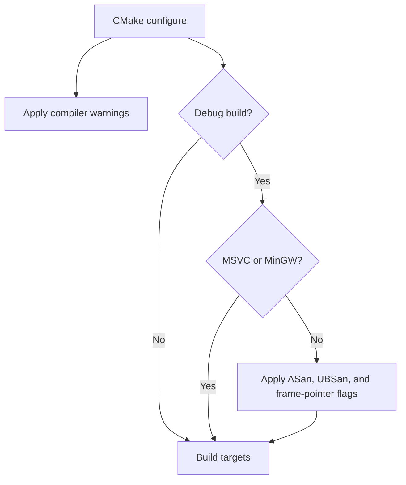
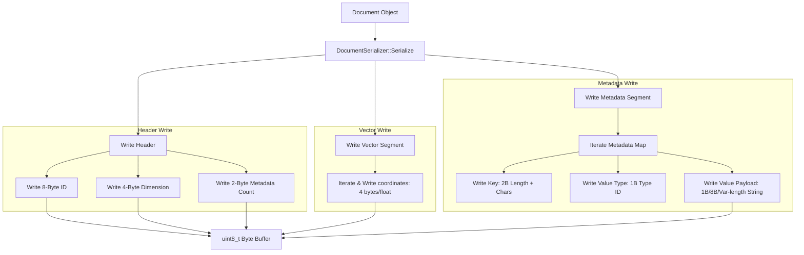
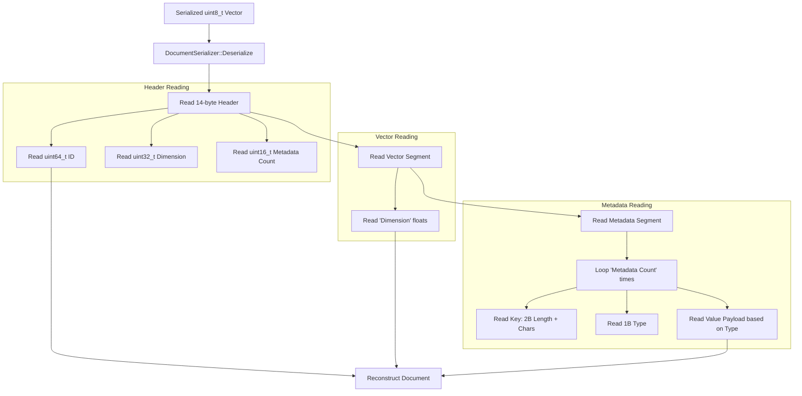
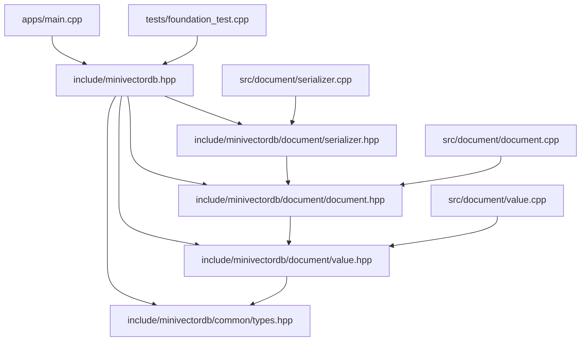
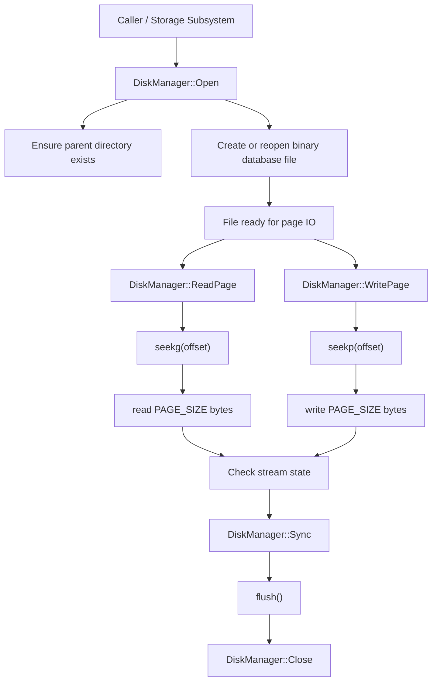

# Execution and Data Flow Maps

## 0. Compiler Flag Selection

## 1. Document Serialization Pipeline

The pipeline below shows how a C++ `Document` object is converted into a sequential byte array:

---

## 2. Document Deserialization Pipeline

The pipeline below maps how a raw byte stream is parsed back into a C++ `Document` object:

---

## 3. Dependency Relationships

---

## 4. Documentation Diagram Validation

Architecture docs are not only prose; they are part of the project interface. When Mermaid diagrams include labels with punctuation or numeric prefixes, the parser can reject the entire graph even though the content is otherwise correct. The project uses explicit quoting for these labels so diagrams remain renderable and the documentation still communicates the same design intent.

---

## 5. Storage File Lifecycle

The storage pipeline is intentionally simple: open a file, operate on fixed-size 4096-byte pages, validate stream state after each transfer, and flush before close or durability-sensitive operations. That keeps page I/O deterministic and debuggable across the rest of the database engine.

