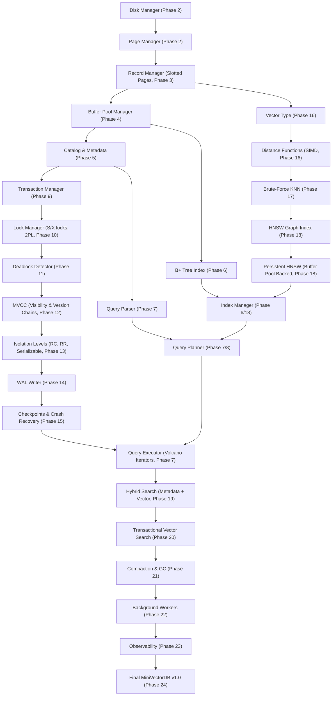

# MiniVectorDB Compilation & Logic Dependency Graph

This document details the compile-time and run-time dependency structure of **MiniVectorDB**. It ensures that components are built in the correct order to guarantee architectural layering.

---

## 1. Subsystem Graph (Mermaid)

---

## 2. Compilation Ordering Reference

When compiling MiniVectorDB, the build system (CMake) structures dependencies to avoid circular inclusions. The layers compile in the following order:

### Layer 1: Core Foundation & Data Formats (Leaf nodes)
- **Document / JSON Variant Type**: Independent representation of JSON documents (`Value`, `Document`).
- **Serializer**: Utility to convert raw structures into binary representation.
- **Common Types**: `page_id_t`, `txn_id_t`, `lsn_t`, `rid_t`.

### Layer 2: Low-Level Storage
- **Disk Manager**: Directly interacts with the file system.
- **Page Manager**: Manipulates raw 4096-byte frames.
- **Buffer Pool**: Manages cache frames and page pinning. Depends on Disk Manager and Page Manager.

### Layer 3: Physical Records & Access Methods
- **Slotted Page**: Physical layout of documents. Depends on Page Manager.
- **Record Manager**: Implements row deletion/insertion/tombstones on slotted pages.
- **B+ Tree Index**: Tree navigation. Depends on Record Manager and Buffer Pool.

### Layer 4: Transactions & Concurrency Control
- **Transaction Manager**: Tracks states of executions.
- **Lock Manager**: Strict 2PL queues. Depends on Transaction Manager.
- **WAL Writer**: Performs writes to WAL files. Must compile alongside Transaction Manager to sync commits.
- **MVCC visibility**: Decides page row visibility based on snapshots.

### Layer 5: Query Execution & Vector Calculations
- **Vector Engine**: Implements distance equations.
- **HNSW Index**: Builds multi-layered graphs. Depends on Vector Engine and Buffer Pool.
- **Query Planner / Executor**: Implements scans. Depends on B+ Tree, HNSW, Catalog, and Transactions.

### Layer 6: Integration & background tasks
- **Compaction & GC**: Cleans up dead rows.
- **Workers**: Handles periodic checkpoint flush, garbage collection, and compaction.
- **Observability**: Exposes internal statistics.
- **MiniVectorDB Client API**: The main application interface linking everything.
