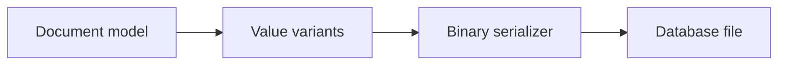
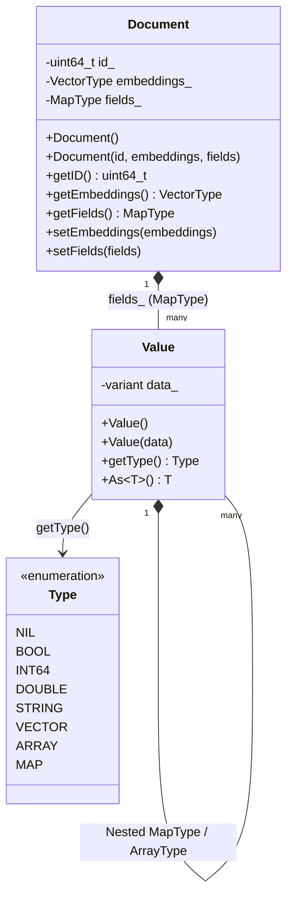

# v0.2 -- Document Model & Dynamic Typing

---

## 1. Problem Statement

## Visual Model

Vector databases store documents containing both unstructured embedding vectors and structured metadata fields. Unlike traditional SQL tables with fixed columns, document-based systems must support dynamic schemas where different records contain different attributes. We need a type-safe dynamically-typed value class capable of representing any JSON-like type (nulls, booleans, integers, doubles, strings, lists, dictionaries) and a structured document wrapper containing the primary key, vector embedding, and metadata map.

---

## 2. Step-by-Step Instructions

### Step 1: Create the Dynamic Value Class
* Create a public header file `include/minivectordb/document/value.hpp` within `namespace DB`.
* Forward-declare the structure `Value`.
* Define the following type aliases below the forward declaration:
  * `MapType`: An ordered dictionary (`std::map`) mapping keys (`std::string`) to `Value` objects.
  * `ArrayType`: A sequential list (`std::vector`) of `Value` objects.
  * `VectorType`: A sequential list (`std::vector`) of `float` numbers (representing the high-dimensional vector embedding).
* Create an `enum class Type` to identify the active type inside a `Value`:
  * Types: `NIL`, `BOOL`, `INT64`, `DOUBLE`, `STRING`, `VECTOR`, `ARRAY`, `MAP`.
* Create `struct Value`:
  * Declare a member variable `data` of type `std::variant` containing the following alternatives:
    1. `std::monostate` (represents `NIL`/null)
    2. `bool`
    3. `int64_t`
    4. `double`
    5. `std::string`
    6. `VectorType`
    7. `ArrayType`
    8. `MapType`
  * Write a default constructor initializing the variant with `std::monostate`.
  * Write convenience constructors for each of the remaining variant types, passing values by value and moving them into the variant using `std::move`.
  * Implement `Type GetType() const`:
    * Check which type alternative is currently active inside the variant and return the corresponding `Type` enum value.
  * Implement a template helper method `const T& As() const`:
    * Attempt to retrieve the value of type `T` from the variant.
    * Catch variant access errors, and throw a `std::runtime_error` instead of letting the default access exception escape.

### Step 2: Create the Document Wrapper Class
* Create a header file `src/document/document.h` within `namespace DB`.
* Include the value header.
* Define `class Document` containing:
  * `id`: An unsigned 64-bit integer representing the primary key.
  * `embedding`: A variable of type `VectorType`.
  * `fields`: A variable of type `MapType` storing the document's metadata attributes.
* Write a default constructor initializing `id` to 0. This is the
  **unassigned** state; `0` is never a persisted document ID.
* Write an initialization constructor taking the ID, embedding, and fields map, moving parameters into the member variables.

---

## 3. C++ Systems Features Primer

If you are transitioning from LeetCode to systems programming, these modern C++ features will be new:

* **Variant Types (`std::variant`)**: In systems programming, we often need a variable to hold different types of values. While C has unions, they are unsafe because they do not track what type is currently active. `std::variant` is a type-safe union that manages constructor/destructor operations for complex types (like `std::string`) and tracks its own active type index.
* **`std::monostate`**: A variant always initializes itself using its first alternative. If we want a variant to be default-constructible as "empty" or "null", we place `std::monostate` (a dummy struct that occupies 1 byte) as the first alternative.
* **Forward Declarations**: If Type A contains Type B, and Type B contains Type A, the compiler gets stuck in an infinite definition loop. We break this by declaring `struct Value;` at the top of the file. This tells the compiler that the name `Value` exists, allowing us to define `MapType` (which references `Value`), before writing the full definition of the `Value` struct.
* **Variant Interrogation**:
  * **`std::holds_alternative<T>(variant)`**: Returns a boolean indicating if the variant currently stores type `T`.
  * **`std::get<T>(variant)`**: Returns a reference to the active value of type `T`. If the variant stores a different type, it throws `std::bad_variant_access`.
* **C++ Templates (`template <typename T>`)**: Allows writing generic code. Instead of writing separate methods like `AsInt()` and `AsString()`, we write a single template method `As<T>()`. The compiler generates the specific types automatically when you call `val.As<std::string>()`.

---

## 4. Functional & Structural Requirements
* **Default State**: A newly declared `Value` object must default to `Type::NIL`.
* **Safe Extraction**: If a user attempts to extract an incorrect type via `val.As<T>()`, the method must throw `std::runtime_error` with a descriptive message (e.g. "Attempted to access wrong type from DB::Value").
* **JSON-Compatibility**: The value class must support nesting (a map can contain arrays, which can contain other maps) to represent arbitrary metadata formats.
* **Document Attributes**: The primary key `id` must be an unsigned 64-bit integer (`uint64_t`).
* **ID Ownership**: `id` is a top-level `Document` member, not a metadata
  field such as `fields["id"]`. Client code must not choose it; the database
  assigns it automatically during insertion.
