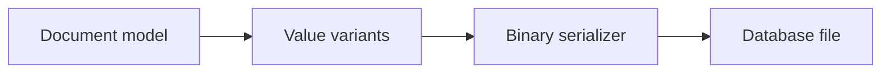
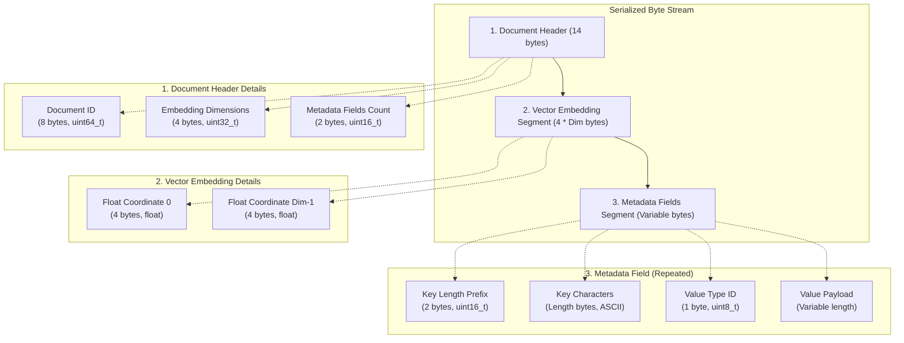

# v0.3 -- Document Serialization & Byte Marshalling

---

## 1. Problem Statement

## Visual Model


C++ objects in memory are often scattered across the heap (for example, a `std::map` uses node pointers, and a `std::string` uses dynamic character arrays). Because physical storage disks and network cards only accept sequential streams of raw bytes, we must convert our dynamic `Document` structures into contiguous byte arrays (`std::vector<uint8_t>`) and decode them back without data loss.

---

## 2. Step-by-Step Instructions

### Step 1: Design the Binary Page Layout Format
To store a variable-length document, we define a layout standard for the byte stream:



#### Visual Byte Layout Representation:
```text
+-------------------+-----------------------+------------------------+
|  Doc ID (8 bytes)  | Vector Dim (4 bytes)  | Metadata Count (2 B)   |  <- Header (14 bytes)
+-------------------+-----------------------+------------------------+
| Float Coord 0 (4B)| Float Coord 1 (4B)    | Float Coord Dim-1 (4B) |  <- Vector Embeddings
+-------------------+-----------------------+------------------------+
| Key Len (2 bytes) | Key Chars (Var bytes) | Value Type ID (1 byte) |  \
+-------------------+-----------------------+------------------------+   +- Metadata Field 0
| Value Payload (Var bytes depending on Type: 1B/8B/Var-length)      |  /
+--------------------------------------------------------------------+
```

### Step 2: Implement the Serializer
* Create a header file `src/document/serializer.h` inside `namespace DB`.
* Create `class DocumentSerializer`.
* Implement `static std::vector<uint8_t> Serialize(const Document& doc)`:
  * Allocate a byte vector to act as the buffer.
* Append the document ID (split into 8 sequential bytes). This is the stable
  logical ID allocated by the database; it is not the internal `RID` used to
  locate bytes on a page.
  * Append the size of the embedding vector (4 bytes).
  * Append the count of metadata dictionary fields (2 bytes).
  * Loop through the embedding vector and append the float bytes of each coordinate.
  * Loop through the metadata map:
    * Append the key string's length (2 bytes).
    * Append the key's raw characters.
    * Append the type byte of the value.
    * Append the value's binary payload based on its type.
  * Return the completed byte vector.

### Step 3: Implement the Deserializer
* Implement `static Document Deserialize(const std::vector<uint8_t>& bytes)`:
  * Maintain a tracking cursor/index indicating the current read position in the byte vector.
  * Write validation helper checks to ensure you never read past the end of the byte vector.
  * Extract the document ID, embedding size, and fields count from the header by reconstructing them from sequential bytes.
  * Extract the embedding floats from the vector segment.
  * Loop for the count of metadata fields:
    * Extract the key length, then read the key characters.
    * Extract the value type byte.
    * Decode the value payload based on the type, constructing a `Value` object.
    * Store the key-value pair in the metadata map.
  * Return the fully reconstructed `Document` object.

---

## 3. C++ Systems Features Primer

To write serialization code, you must master low-level memory operations not used in LeetCode:

* **Bitwise Shifts (`<<`, `>>`, `&`)**: When writing an integer to a byte stream, we must convert it into individual bytes. For example, to split a 16-bit integer `val` into 2 bytes:
  `uint8_t byte0 = val & 0xFF;` (gets the lowest 8 bits)
  `uint8_t byte1 = (val >> 8) & 0xFF;` (gets the highest 8 bits)
  During deserialization, we reconstruct the value:
  `uint16_t val = byte0 | (byte1 << 8);`
* **Pointer Casting (`reinterpret_cast`)**: Tells the compiler to treat a pointer of one type as a pointer to a completely different type. For example, a `float` occupies 4 bytes. To serialize a float, we cast its address to a byte pointer:
  `const uint8_t* byte_ptr = reinterpret_cast<const uint8_t*>(&float_val);`
  This lets us copy the 4 raw bytes of the float directly into our byte buffer.
* **`std::memcpy`**: A standard function that copies a block of memory from a source address to a destination address. It is faster than looping because it copies memory in bulk at the CPU register level:
  `std::memcpy(destination_ptr, source_ptr, num_bytes);`
* **Endianness**: A CPU architecture detail. Intel CPUs (Little-Endian) write integers to memory with the least significant byte first. Other systems (Big-Endian) write the most significant byte first. Databases standardize on a single layout format (usually Little-Endian) to ensure database files remain readable if moved to a different computer system.

---

## 4. Functional & Structural Requirements
* **Determinism**: Serializing the same document twice must produce identical byte streams.
* **Accuracy**: Deserializing a serialized byte stream must yield a document containing values identical to the original document.
* **Buffer Safety**: If the deserializer cursor exceeds the input byte array size at any point, the program must throw a `std::runtime_error` (e.g. "Deserialization error: buffer overflow") to prevent reading garbage memory.
* **Width Standard**: Values must use fixed sizes: floats must be 4 bytes, doubles and 64-bit integers must be 8 bytes, metadata keys must be limited to 65,535 characters (2 bytes length prefix).
* **ID Round Trip**: A non-zero document ID must survive a
  `Serialize`/`Deserialize` round trip unchanged.
