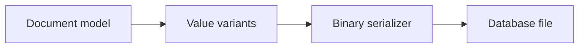

# v0.4 -- Persistent Database Files & OS Disk Sync

---

## 1. Problem Statement

## Visual Model

Data stored in RAM is volatile and disappears when the computer power cuts or the database process terminates. To build a durable storage engine, we must design a **`DiskManager`** that interacts directly with the filesystem. It must open files in binary mode, read and write blocks of bytes at specific offsets, and force the operating system to flush cache tables to the physical SSD/hard drive.

---

## 2. Step-by-Step Instructions

### Step 1: Declare the Disk Manager Abstraction
* Create a header file `src/storage/disk_manager.h` within `namespace DB`.
* Include the type aliases header (`minivectordb/common/types.hpp`).
* Declare `class DiskManager` containing:
  * A file stream member `db_file` of type `std::fstream`.
  * A string `file_path` storing the path of the database file.
  * Helper variables tracking if the file is currently open.
* Declare the following public methods:
  * `void Open(const std::filesystem::path& path)`: Opens or creates the database file.
  * `void Close()`: Closes the active file stream cleanly.
  * `void ReadPage(PageID page_id, uint8_t* buffer)`: Reads a block of bytes from disk into a buffer.
  * `void WritePage(PageID page_id, const uint8_t* data)`: Writes a block of bytes from a buffer to disk.
  * `void Sync()`: Forces the OS file caches to flush directly to physical storage.

### Step 2: Implement the File Operations
* Create a source file `src/storage/disk_manager.cpp`.
* Implement `Open()`:
  * Standard database page sizes are 4096 bytes (4KB). Define a constant `PAGE_SIZE = 4096`.
  * Open the database file using `std::fstream`. You must pass flags to configure binary mode, read access, and write access.
  * If the file does not exist, create it by opening it with write-truncation flags first, then reopening it in read/write mode.
  * Check if the file stream failed to open, and throw a `std::runtime_error` if so.
* Implement `ReadPage()` and `WritePage()`:
  * Calculate the target file position: `offset = page_id * PAGE_SIZE`.
  * Call file seek operations to position the read/write cursor at the calculated offset.
  * Call the stream's read or write method to transfer exactly `PAGE_SIZE` bytes between your memory buffer and the file.
  * Verify that the stream did not hit an EOF or error condition during the transfer, throwing `std::runtime_error` on failure.
* Implement `Sync()`:
  * Call the stream's flush method to empty C++ buffers to the OS.
  * (Optional/Advanced requirement) databases must ensure durability. Look up how to extract the OS file handle from `std::fstream` (or use raw system APIs) and call the OS-specific file sync operation (e.g. `_commit` or Win32 `FlushFileBuffers` on Windows, or `fsync` on Linux/Unix systems) to flush OS cache tables to physical disk gates.

---

## 3. C++ Systems Features Primer

To write file handlers, you need to understand file system interfaces:

* **File Streams (`std::fstream`)**: C++ streams default to text mode. In text mode, operating systems translate specific characters (for example, on Windows, writing `\n` automatically inserts `\r\n`). In databases, raw bytes represent data payloads. If the OS alters byte sequences, the file gets corrupted. We must pass **`std::ios::binary`** to preserve byte values.
* **File Open Flags**: To open files for both reading and writing without erasing existing content, we combine flags using bitwise OR:
  `std::ios::in | std::ios::out | std::ios::binary`
* **File Seek Positioning**: Files are indexed like arrays. To read from page 3, we calculate the byte offset and jump to it:
  * **`seekg(offset)`**: Jumps the read cursor (Get pointer) to the target byte offset.
  * **`seekp(offset)`**: Jumps the write cursor (Put pointer) to the target byte offset.
* **System Flushes vs. Disk Syncs**:
  * `db_file.flush()` pushes data from C++ runtime buffers to the operating system's kernel cache table.
  * If the machine loses power at this moment, the data inside the OS kernel cache is lost!
  * We must issue a system call (like `_commit` on Windows or `fsync` on Unix) to force the OS kernel to flush its cache tables to the SSD's non-volatile hardware registers.

---

## 4. Structural & Functional Requirements
* **Binary Integrity**: The database file stream must always open with `std::ios::binary` enabled.
* **Fixed Blocks**: All database page read and write operations must transfer exactly 4096 bytes (`PAGE_SIZE == 4096`).
* **Error Handling**: Any file access failure, permission issue, or read/write bottleneck must throw a descriptive C++ runtime exception (`std::runtime_error`).
* **Creation Policy**: If the target database file does not exist, `Open()` must create a new empty file.
