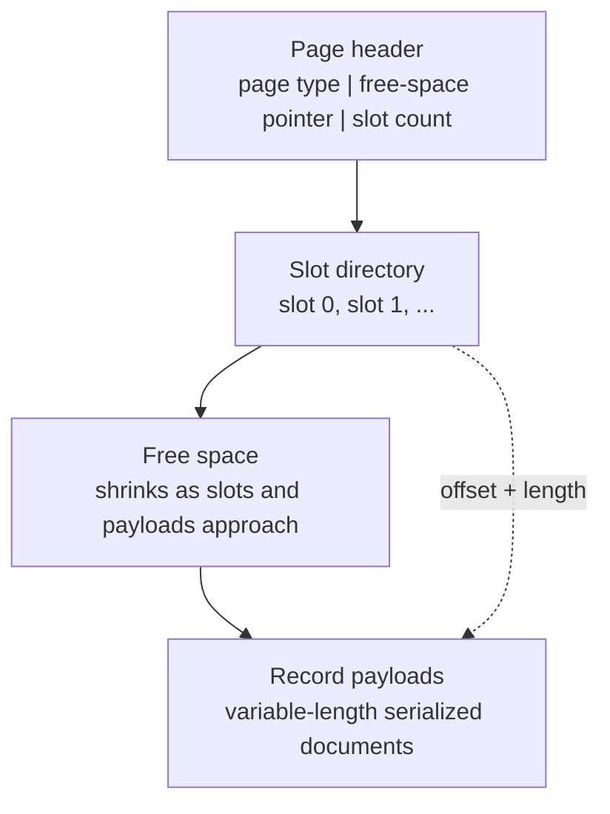

# v0.10 -- Slotted Page Layout & Variable-Length Records

---

## 1. Problem Statement

## Visual Model

### Slotted Page Geometry

Fixed-size slot allocation formats (where every record occupies, e.g., 512 bytes) are highly inefficient: small records waste disk space (internal fragmentation), and large records fail to fit. To pack variable-length records (documents and vector arrays) tightly inside a single 4096-byte page, we must implement a **Slotted Page Layout** that manages slot directories growing downward from the page start, and record payloads growing upward from the page bottom, meeting in the middle.

---

## 2. Step-by-Step Instructions

### Step 1: Design Slotted Layout Structures
* Create a header file `src/storage/slotted_page.h` within `namespace DB`.
* Include the base page header (`src/storage/page.h`) and standard library headers (`` and `<cstring>`).
* Wrap the layout structs inside compiler packing directives (`#pragma pack(push, 1)`):
  * **`PageSlot`**: Represents a directory entry mapping a slot to physical data:
    * `offset` (uint16_t): Byte offset of the record from the start of the page data buffer.
    * `length` (uint16_t): Byte length of the record (0 if deleted).
  * **`SlottedPageHeader`**: Resides at the very start of the page's data payload:
    * `free_space_pointer` (uint16_t): Top boundary of the free space (initially set to `PAGE_DATA_SIZE`).
    * `slot_count` (uint16_t): Active count of directories in the page.

### Step 2: Implement Layout Pointer Helpers
* Create `class SlottedPage` containing static helper methods:
  * `SlottedPageHeader* GetHeader(Page* page)`: Casts the page data address to retrieve a pointer to the slotted header.
  * `PageSlot* GetSlotDirectory(Page* page)`: Retrieves a pointer to the slot directory array. Since the array resides immediately after the header, calculate its memory address by shifting the data pointer by the size of `SlottedPageHeader`.
  * `uint8_t* GetRecordPointer(Page* page, uint16_t slot_num)`: Accesses the target slot in the directory, retrieves its offset, and returns a pointer to the record payload inside the page.
  * `uint32_t GetFreeSpace(const Page* page)`:
    * Calculate the top occupied space:
      $$\text{Occupied Top} = \text{sizeof(SlottedPageHeader)} + (\text{slot\_count} \times \text{sizeof(PageSlot)})$$
    * Return `free_space_pointer - Occupied Top`. If `free_space_pointer` is less than `Occupied Top`, return `0` (page is full).

### Step 3: Implement Dual-Direction Record Insertion
* Implement `int32_t InsertRecord(Page* page, std::span<const uint8_t> record_data)`:
  * Verify that the page has enough free space to accommodate the new record's payload AND a new directory slot (4 bytes). Return `-1` if not.
  * Retrieve the slotted header and slot directory pointers.
  * **Allocate Payload**: Decrement the header's `free_space_pointer` by the size of the record. This moves the pointer upward from the page bottom.
  * **Write Bytes**: Copy the bytes from the input `std::span` to the page data array at the new offset using `std::memcpy`.
  * **Add Slot**: Assign the slot number as `slot_num = slot_count`. Set `slots[slot_num].offset` to the new offset, and `slots[slot_num].length` to the record size.
  * **Increment Directory**: Increment the header's `slot_count` by `1`.
  * Return the assigned `slot_num`.

---

## 3. C++ Systems Features Primer

* **Pointer Arithmetic**: In systems programming, pointers represent memory locations. We can navigate memory buffers by adding integers directly to pointers:
  `page->data + offset`
  returns the address offset by `offset` bytes from the start of the page payload buffer.
* **Non-owning Views (`std::span`)**: Added in C++20, `std::span` represents a contiguous sequence of objects. Passing a `std::vector` to a function creates a copy of the vector. Passing a `std::span` passes only a pointer to the start of the array and its length, which is extremely fast and avoids memory allocations.
* **Struct Casting via Offsets**: To read the slot directory, we offset the raw page data pointer by the size of the slotted header:
  `reinterpret_cast<PageSlot*>(page->data + sizeof(SlottedPageHeader))`
  This lets us treat that exact region of the page data buffer as an array of `PageSlot` entries.

---

## 4. Functional & Structural Requirements
* **Standard Pack**: `PageSlot` must be exactly 4 bytes in size. `SlottedPageHeader` must be exactly 4 bytes.
* **Initial Bounds**: A reset slotted page must initialize `free_space_pointer = PAGE_DATA_SIZE` (4068 bytes).
* **Insertion Limit**: If `GetFreeSpace()` is smaller than `record_size + 4` bytes, `InsertRecord` must reject the insertion and return `-1`.
* **Alignment Checks**: Record boundaries inside the slotted page must be preserved exactly, preventing off-by-one errors when reading records.
