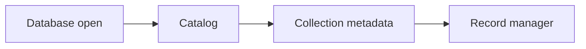

# v0.17 -- Collection Manager & Namespaces

---

## 1. Problem Statement

## Visual Model

To prevent data overlap and organize database storage, records must be isolated into distinct logical tables or **Collections** (namespaces like "customers" or "products"). We must design the schema definitions mapping collection names to physical file page chains, and define an abstract C++ interface class enforcing a contract for collection operations (creating, dropping, and fetching collection metadata).

---

## 2. Step-by-Step Instructions

### Step 1: Design Collection Metadata
* Create a header file `src/catalog/collection_metadata.h` within `namespace DB`.
* Include exact-width type and string headers.
* Define `struct CollectionMetadata`:
  * Declare variables:
    * `name` (std::string): Unique string identifier of the collection.
    * `first_page_id` (PageID): Starting slotted data PageID containing the collection's row entries.
    * `vector_dimensions` (uint32_t): Allowed dimensional count for vectors in this collection.
    * `next_document_id` (uint64_t): The next logical document ID to allocate
      for this collection. Initialize it to `1` for a newly created collection.
  * Write convenience constructors (initializing variables, passing strings by value, and moving them into member storage).

### Step 2: Define the Collection Manager Interface
* Define `class CollectionManager` inside the header:
  * Declare a public virtual destructor: `virtual ~CollectionManager() = default;` (this guarantees clean deallocations during inheritance).
  * Declare the following pure virtual methods:
    * `virtual void CreateCollection(const std::string& name, uint32_t dimensions) = 0`: Allocates starting page slots and updates catalog lists.
    * `virtual CollectionMetadata GetCollection(const std::string& name) = 0`: Retrieves collection metadata descriptors.
    * `virtual void DropCollection(const std::string& name) = 0`: Discards catalog mappings and recycles pages.
    * `virtual uint64_t ReserveDocumentID(const std::string& collection_name) = 0`:
      atomically reserves and returns the collection's next logical document
      ID. It increments the stored counter before returning.

---

## 3. C++ Systems Features Primer

* **Abstract Classes & Interfaces**: In systems code, we often decouple the API interface (how a class is called) from the concrete implementation details. An abstract class is a class containing at least one pure virtual function (a method declared with `= 0` at the end). You cannot instantiate an abstract class directly. It acts as a template for other classes.
* **Pure Virtual Functions (`= 0`)**: Tells the compiler: *"The base class will not provide code for this method. Any class that inherits from this base class MUST write the implementation code, or compilation will fail."*
* **Virtual Destructors**: In C++, when a child class inherits from a parent class, deleting the child object using a parent class pointer will leak memory if the parent's destructor is not virtual. Marking the destructor as `virtual` tells the compiler to check the object type at runtime and call the correct sequence of child destructors.

---

## 4. Functional & Structural Requirements
* **Logical Indirection**: The catalog mapping must bind a collection string name to a physical starting `PageID` on disk.
* **Destructor safety**: The base interface class `CollectionManager` must declare a virtual destructor.
* **Type Invariants**: `first_page_id` must default to `INVALID_PAGE_ID`, and `vector_dimensions` must default to `0`.
* **Zero instances**: The base class `CollectionManager` must be an abstract class, preventing direct instantiation.
* **Initial ID Counter**: A newly created collection must start with
  `next_document_id == 1`.
