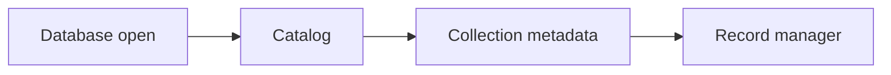

# v0.18 -- The System Catalog Directory

---

## 1. Problem Statement

## Visual Model


To execute queries, a database engine needs to keep track of its own schema directory (the **System Catalog**). The catalog must register collections, track index configurations (mapping collections and field names to physical starting root Page IDs on disk), protect lookup tables from multi-threaded conflicts using shared locks, and reject references to invalid or non-existent tables.

---

## 2. Step-by-Step Instructions

### Step 1: Design Index Metadata
* Open `src/catalog/collection_metadata.h` or create `src/catalog/catalog.h` within `namespace DB`.
* Include exact-width type and container headers.
* Define `struct IndexMetadata` representing index configurations:
  * `name` (std::string): Unique string name of the index.
  * `collection_name` (std::string): Target collection name this index is built on.
  * `field_name` (std::string): Document attribute field path indexed (e.g., "age").
  * `is_vector_index` (bool): True if HNSW vector graph index; false if B+ Tree index.
  * `root_page_id` (PageID): Starting physical block PageID on disk where the index starts (defaults to `INVALID_PAGE_ID`).
  * Write convenience initialization constructors.

### Step 2: Declare the Catalog Class
* Define `class Catalog`:
  * Declare private member variables:
    * `collections` (hash map mapping `std::string` names to `CollectionMetadata`).
    * `indexes` (nested hash maps mapping `std::string` collection names to an inner map of `std::string` fields to `IndexMetadata` structures):
      `std::unordered_map<std::string, std::unordered_map<std::string, IndexMetadata>> indexes;`
    * `catalog_mutex` (type `std::shared_mutex` marked with the **`mutable`** keyword).
  * Declare the following public methods:
    * `void AddCollection(const CollectionMetadata& meta)`
    * `CollectionMetadata GetCollection(const std::string& name) const`
    * `bool HasCollection(const std::string& name) const`
    * `void AddIndex(const IndexMetadata& meta)`
    * `IndexMetadata GetIndex(const std::string& collection, const std::string& field) const`
    * `bool HasIndex(const std::string& collection, const std::string& field) const`
    * `std::unordered_map<std::string, CollectionMetadata> GetAllCollections() const`
    * `std::unordered_map<std::string, std::unordered_map<std::string, IndexMetadata>> GetAllIndexes() const`
    * `uint64_t ReserveDocumentID(const std::string& collection_name)`

### Step 3: Implement Collection & Index Registries
* Implement `AddCollection(meta)`:
  * Acquire an exclusive write lock (`std::unique_lock`) on `catalog_mutex`.
  * Verify if the collection `meta.name` already exists in `collections`. If yes, throw a `std::runtime_error`.
  * Store the metadata: `collections[meta.name] = meta;`.
* Implement `GetCollection(name)`:
  * Acquire a shared read lock (`std::shared_lock`) on `catalog_mutex`.
  * Search for the collection using `find()`. If not found, throw a `std::runtime_error`. Return the metadata copy.
* Implement `AddIndex(meta)`:
  * Acquire an exclusive write lock.
  * Verify that `meta.collection_name` exists inside the `collections` map. If not, throw a `std::runtime_error` (cannot index a non-existent table).
  * Store the index: `indexes[meta.collection_name][meta.field_name] = meta;`.
* Implement `GetIndex(collection, field)`:
  * Acquire a shared read lock.
  * Scan the nested `indexes` maps using `find()`. If the collection map or the field map is not found, throw a `std::runtime_error`. Return the index metadata.
* Implement `ReserveDocumentID(collection_name)`:
  * Acquire an exclusive `std::unique_lock` on `catalog_mutex` because the
    counter is being changed.
  * Locate the collection; throw `std::runtime_error` if it does not exist.
  * Save the current `next_document_id` as `id`, increment the metadata field,
    and return `id`.
  * Never reuse an ID, including when a later write fails. Gaps are valid and
    avoid unsafe counter rollbacks.

After this phase, refactor `RecordManager::InsertDocument` to ask the Catalog
for the ID using the target collection name. Remove its temporary in-memory
counter. The final flow is:

```text
Catalog::ReserveDocumentID("articles") -> 42
RecordManager sets stored_document.id = 42
DocumentSerializer writes 42 into the document header
RecordManager stores bytes and returns an internal RID
```

---

## 3. C++ Systems Features Primer

* **Nested Maps**: We use nested associative containers to build multi-dimensional indices:
  `indexes[collection_name][field_name] = meta`
  This models a directory hierarchy: looking up the collection first, then looking up the indexed field to find the configuration.
* **The `mutable` Keyword**: In C++, functions marked `const` (like `GetCollection() const`) cannot modify any class member variables. However, to read the collections map thread-safely, we must acquire a shared lock on the mutex. Locking changes the internal state of the mutex, which triggers compiler errors inside `const` methods. Marking the lock variable as `mutable std::shared_mutex` overrides this constraint, allowing compile locks inside `const` read paths.
* **Guarded Map Access (`map.find`)**: In LeetCode/DSA, you might check key existence using `if (map[key])`. In C++, the subscript operator `[]` automatically inserts a default-constructed value if the key does not exist. To check existence without modifying the map, we use `map.find(key)` which returns an iterator.

---

## 4. Functional & Structural Requirements
* **Namespace Uniqueness**: Attempting to register a collection that already exists must throw a `std::runtime_error`.
* **Collection Verification**: Registering an index on a non-existent collection must throw a `std::runtime_error`.
* **Read-Write Locking**: Lookups must acquire shared locks, while mutations must acquire exclusive locks.
* **Const Mutexes**: The catalog mutex must be declared `mutable` to permit compile locks inside `const` getters.
* **Thread-Safe ID Allocation**: `ReserveDocumentID` must use the exclusive
  catalog lock, so concurrent inserts into the same collection cannot receive
  the same ID.
