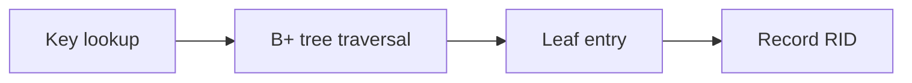

# v0.23 -- B+ Tree Deletions, Borrowing, & Merges

---

## 1. Problem Statement

## Visual Model

Deletions shrink B+ Trees. If keys are removed without checks, pages eventually empty out (underflow), causing space wastage and degrading search tree balance. We need to implement a deletion engine (`BTreeDeleter`) that traverses to the target leaf page, erases elements while preserving sorted order, and checks for underflow conditions (size dropping below 50% capacity). If underflow occurs, the engine must either borrow elements from adjacent sibling nodes (redistribution) or merge nodes (coalesce) to consolidate space, recursively propagating corrections up to parent nodes.

---

## 2. Step-by-Step Instructions

### Step 1: Implement Node Coalescing (Merging)
* Create a header file `src/index/btree_delete.h` within `namespace DB`.
* Include the search and helper headers.
* Declare `class BTreeDeleter` containing:
  * A member variable pointing to `DiskManager`.
  * Private helper `void Coalesce(PageID parent_id, PageID left_id, PageID right_id)`:
    * Read parent, left child, and right child pages from disk.
    * **Move Elements**: Copy all keys and values (or child pointers) from the right page to the end of the left page's arrays.
    * **Link Sibling Chain**: Update the left page sibling link: `left.next_page_id = right.next_page_id`.
    * Update the left page's size: `left_size += right_size`.
    * **Update Parent**: Find the index of the separator key in the parent pointing to the right child.
      * Shift parent keys and child pointers to the left to erase the separator key and pointer.
      * Decrement the parent's size.
    * Save parent and left child pages.
    * Call `disk_manager->DeallocatePage(right_id)` to recycle the empty right block.

### Step 2: Implement Sibling Borrowing (Redistribution)
* Inside `class BTreeDeleter`, declare:
  * Private helper `void BorrowFromSibling(PageID parent_id, PageID receiver_id, PageID donor_id, bool is_left_sibling)`:
    * Read parent, receiver, and donor pages from disk.
    * **If Left Sibling**:
      * Pop the last entry (largest key and value) from the donor page.
      * Prepend it to the receiver page (shifting existing elements right).
      * Update the corresponding separator key in the parent node to match the receiver's new first key.
    * **If Right Sibling**:
      * Pop the first entry (smallest key and value) from the donor page.
      * Append it to the end of the receiver page.
      * Update the corresponding separator key in the parent node to match the donor's new first key.
    * Update sizes on receiver and donor pages.
    * Save all pages back to disk.

### Step 3: Implement Page Deletion Logic
* Implement the public entry method `void Delete(PageID* root_id, int64_t key)`:
  * If `*root_id == INVALID_PAGE_ID`, return immediately.
  * Traverse the internal nodes to locate the leaf Page ID containing `key`.
  * Load the leaf page. Find the key's index using binary search.
  * If the key exists, shift all elements after it to the left to erase the entry. Decrement size.
  * Save leaf page.
  * **Handle Underflow**:
    * If `size < max_size / 2` (underflow threshold):
      * Look up the left and right sibling Page IDs inside the parent node.
      * **Try Borrowing**: If a sibling has extra keys (`size > max_size / 2`):
        * Call `BorrowFromSibling()`.
      * **Try Merging**: If no sibling has extra keys:
        * Call `Coalesce()` to merge the underflowed page with its left (or right) sibling.
        * If a merge occurred, check if parent size drops below underflow boundaries, recursively propagating borrow/merge corrections up the tree.

---

## 3. C++ Systems Features Primer

* **Underflow Threshold**: To keep search paths balanced, B+ Trees enforce a minimum fill factor (typically 50% of `max_size`). If a node falls below this threshold, it is merged with a sibling or borrows elements.
* **Borrowing vs. Merging**:
  * **Borrowing (Redistribution)**: Transfers elements between sibling pages. It is fast and keeps both pages active, requiring only updates to the parent separator keys.
  * **Merging (Coalescing)**: Merges all elements into one page and deletes the empty page. This decreases the parent's pointer count and can cause parent underflows.
* **Root Shrinking**: A B+ Tree decreases in height only when the root node underflows. If an internal root node size drops to `0` (it only has one remaining child pointer), that child page becomes the new root node, and the old root page is deallocated.

---

## 4. Functional & Structural Requirements
* **Threshold Check**: The underflow condition must be evaluated as `size < max_size / 2`.
* **Page Deallocation**: Merged pages must be deleted from disk and returned to the allocation free list.
* **Recursive Triggers**: If a merge causes a parent node to underflow, the parent must recursively trigger borrow or merge sweeps.
* **Separator Key Alignments**: Borrowing operations must update parent boundary keys immediately to reflect the new boundaries.
