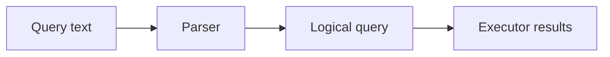

# v0.27 -- The Query Compiler & Parser

---

## 1. Problem Statement

## Visual Model

Client applications send database filter parameters as text strings (e.g. `"age > 20"` or JSON attributes) rather than C++ objects. Checking text directly inside execution loops is slow and prone to errors. We need to implement a compiler utility class (**`QueryParser`**) that tokenizes input strings, maps text comparison operators, and builds an executable C++ AST expression tree.

---

## 2. Step-by-Step Instructions

### Step 1: Design the Query Parser Class
* Create a header file `src/query/query_parser.h` within `namespace DB`.
* Include the expression header and stringstream header (`<sstream>`).
* Define `class QueryParser`:
  * Declare a public static compilation helper:
    `static std::unique_ptr<Expr> ParseSimpleFilter(const std::string& query_str)`

### Step 2: Implement Stream Tokenization
* Implement `ParseSimpleFilter(query_str)`:
  * Instantiate a stringstream: `std::stringstream ss(query_str);`.
  * Declare variables: `field` (std::string), `op` (std::string), and `int_val` (int64_t).
  * Read variables from the stream sequentially:
    `if (!(ss >> field >> op >> int_val))`
    * If the stream read fails (incomplete format), throw a `std::runtime_error` showing the invalid syntax string.
  * **Compile AST**:
    * Instantiate the left child node: `left = std::make_unique<FieldExpr>(field)`.
    * Instantiate the right child node: `right = std::make_unique<LiteralExpr>(Value(int_val))`.
    * Map the operator string to `BinaryExpr::Op`:
      * If `op == "="` or `op == "=="`, set `binary_op = BinaryExpr::Op::EQ`.
      * If `op == ">"`, set `binary_op = BinaryExpr::Op::GT`.
      * If `op == "<"`, set `binary_op = BinaryExpr::Op::LT`.
      * If the operator is unknown, throw a `std::runtime_error`.
    * Construct and return the parent node:
      `return std::make_unique<BinaryExpr>(std::move(left), binary_op, std::move(right));`

---

## 3. C++ Systems Features Primer

* **Stream Parsing (`std::stringstream`)**: In LeetCode/DSA, you might split strings using loops or regex filters. In systems C++, we load strings into `std::stringstream` from `<sstream>`. The stream uses the extractor operator (`>>`) to read values sequentially, splitting tokens automatically by whitespace and converting them to matching types (e.g. converting `"25"` directly to the integer variable `int_val`).
* **Text Compilers**: Translating code or text strings into memory trees. A parser does two things:
  1. **Lexical Analysis (Lexing)**: Splits text strings into individual tokens (words and symbols).
  2. **Syntax Analysis (Parsing)**: Analyzes tokens against grammar rules to build an AST structure.
* **Compiling Filters**: Compiling a query once to an AST allows the database engine to run checks efficiently. For every document checked, it calls `Evaluate(doc)` on the compiled AST node, running compiled machine instructions rather than parsing text strings repeatedly.

---

## 4. Functional & Structural Requirements
* **API Return**: The parser must return a polymorphic `std::unique_ptr<Expr>` pointer.
* **Token Extraction**: The parser must parse strings separated by whitespace, extracting `[field] [operator] [value]`.
* **Syntax Validation**: Any syntax failure or unsupported operator must throw a `std::runtime_error` to halt processing.
* **Resource Cleanup**: If parsing fails mid-execution, all partially allocated unique pointers must be destroyed automatically.
