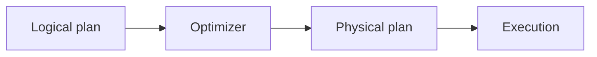

# v0.32 -- Logical Query Plans

---

## 1. Problem Statement

## Visual Model

To optimize database queries before executing them, we must decouple the logical description of a query (the "what") from its physical execution algorithm (the "how"). We need to design a tree of relational algebra operations called a **Logical Plan** composed of polymorphic nodes: a base plan node interface, collection scans (`LogicalScan`), and row filters (`LogicalFilter`).

---

## 2. Step-by-Step Instructions

### Step 1: Design the Logical Plan Node Interface
* Create a header file `src/query/logical_plan.h` within `namespace DB`.
* Include the string, memory, utility, and expression headers.
* Define `enum class LogicalNodeType { SCAN, FILTER, PROJECT }` representing relational algebra steps.
* Define `class LogicalPlanNode`:
  * Declare a public virtual destructor.
  * Declare pure virtual query methods:
    * `virtual LogicalNodeType GetType() const = 0`: Returns the operator type enum.
    * `virtual std::string ToString() const = 0`: Formats the node hierarchy into a debug string.

### Step 2: Implement Logical Scan Nodes
* Define `class LogicalScan` (inheriting from `LogicalPlanNode`):
  * Declare a private string `collection_name`.
  * Write a constructor storing this name.
  * Override `GetType()` to return `LogicalNodeType::SCAN`.
  * Override `ToString()` returning a description (e.g. `"LogicalScan(users)"`).
  * Implement `std::string GetCollectionName() const` returning the target collection name.

### Step 3: Implement Logical Filter Nodes
* Define `class LogicalFilter` (inheriting from `LogicalPlanNode`):
  * Declare private variables:
    * `child` (type `std::unique_ptr<LogicalPlanNode>`): The source data operator node.
    * `filter_expr` (type `std::unique_ptr<Expr>`): The filtering comparison tree.
  * Write a constructor taking unique pointer parameters and moving them into member storage using `std::move`.
  * Override `GetType()` to return `LogicalNodeType::FILTER`.
  * Override `ToString()` formatting the child hierarchy.
  * Implement getter methods:
    * `const LogicalPlanNode* GetChild() const` returning a raw pointer to the child node.
    * `const Expr* GetFilterExpr() const` returning a raw pointer to the filter expression.

---

## 3. C++ Systems Features Primer

* **Relational Algebra**: A branch of mathematics describing operations on structured data. Queries are modeled as a pipeline of operators:
  * **Scan**: Read rows from a collection.
  * **Filter (Selection)**: Check expressions on each row, yielding only matches.
  * **Project (Projection)**: Discard columns that are not needed.
* **Separation of Concerns**: A logical plan is a pure description. It does not load database files or allocate buffer frames. It exists only to let the query compiler inspect, validate, and reorganize search paths algebraically.
* **Smart Pointer Trees**: We construct trees by nesting unique pointers: a filter node holds a unique pointer to its scan node child. Because child nodes are owned exclusively by their parents, deleting the root parent node automatically destroys all child nodes down the tree, preventing leaks.

---

## 4. Functional & Structural Requirements
* **Type Identifiers**: Nodes must register their type using the `LogicalNodeType` enum class.
* **Exclusive Ownership**: Child node links must be managed using `std::unique_ptr<LogicalPlanNode>`.
* **Inspectable References**: Read-only methods (`GetChild()`, `GetFilterExpr()`) must return raw const pointers, permitting inspections without taking ownership.
* **Format printing**: `ToString` must print nesting levels representing tree layouts clearly.
