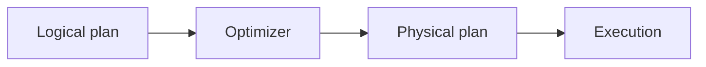

# v0.33 -- Physical Query Plans

---

## 1. Problem Statement

## Visual Model

Logical query plans represent algebraic operations (the "what"), but they lack details on the concrete algorithms used to access disk or index pages (the "how"). We must design the physical query engine descriptors (**Physical Plans**) that map abstract logical nodes to exact execution strategies (such as translating a table fetch into a physical sequential scan or a B+ Tree range lookup), declaring node interfaces, and compiling execution parameters.

---

## 2. Step-by-Step Instructions

### Step 1: Design the Physical Plan Node Interface
* Create a header file `src/query/physical_plan.h` within `namespace DB`.
* Include the string, memory, utility, and type headers.
* Define `enum class PhysicalNodeType { SEQ_SCAN, INDEX_SCAN, FILTER }` representing concrete query execution strategies.
* Define `class PhysicalPlanNode`:
  * Declare a public virtual destructor: `virtual ~PhysicalPlanNode() = default;`.
  * Declare pure virtual query methods:
    * `virtual PhysicalNodeType GetType() const = 0`: Returns the physical operator type enum.
    * `virtual std::string ToString() const = 0`: Formats the physical node description.

### Step 2: Implement Physical Sequential Scan Nodes
* Define `class PhysicalSeqScan` (inheriting from `PhysicalPlanNode`):
  * Declare a private string `collection_name`.
  * Write a constructor storing this name.
  * Override `GetType()` to return `PhysicalNodeType::SEQ_SCAN`.
  * Override `ToString()` returning a description (e.g. `"PhysicalSeqScan(users)"`).
  * Implement `std::string GetCollectionName() const` returning the target collection name.

### Step 3: Implement Physical Index Scan Nodes
* Define `class PhysicalIndexScan` (inheriting from `PhysicalPlanNode`):
  * Declare private variables:
    * `collection_name` (std::string).
    * `field_name` (std::string): The indexed document attribute.
    * `index_root_id` (PageID/int64_t): Starting physical root Page ID of the B+ Tree.
    * `key_start` (int64_t): Range start boundary.
    * `key_end` (int64_t): Range end boundary.
  * Write a constructor mapping all variables.
  * Override `GetType()` to return `PhysicalNodeType::INDEX_SCAN`.
  * Override `ToString()` formatting the collection and field details.
  * Implement getters returning all private variables (`GetCollectionName()`, `GetFieldName()`, `GetIndexRootId()`, `GetKeyStart()`, `GetKeyEnd()`).

---

## 3. C++ Systems Features Primer

* **Decoupling Plans from Execution**: A physical plan is a descriptor tree (similar to a compiled recipe). It does not hold state variables, loop indexes, or open files. The execution engine reads the physical plan and creates Volcano executors (`SeqScanExecutor`, `IndexScanExecutor`) to run it, separating plan selection from execution states.
* **Algebraic Translation**: A single logical step often has multiple physical implementations. For example:
  * **Logical Scan** $\rightarrow$ Can be built physically as a **Sequential Scan** (read all pages) OR an **Index Scan** (read only pages pointing to matching keys).
* **Header Alias Imports**: Physical plan nodes track physical settings (like `PageID` numbers). We import `minivectordb/common/types.hpp` to resolve these systems-level type aliases.

---

## 4. Functional & Structural Requirements
* **Type Identifiers**: Nodes must register their type using the `PhysicalNodeType` enum class.
* **Stable Layout**: Physical plan nodes must act as immutable descriptors after constructor initialization, containing no mutable runtime cursors.
* **Clean Deallocations**: The base class must declare a virtual destructor, preventing resource leaks.
* **Getter Integrity**: Plan getters must return the exact configurations provided during construction.
