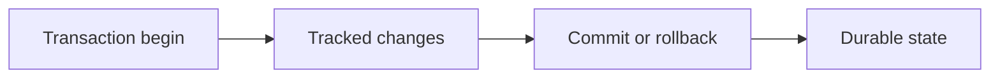

# v0.37 -- Transaction Abstraction & States

---

## 1. Problem Statement

## Visual Model

To ensure ACID guarantees (Atomicity, Consistency, Isolation, Durability), a database engine must track queries executing together under a single logical unit of work called a **Transaction**. Transactions operate asynchronously across multiple thread tasks. We need to implement a **`Transaction`** descriptor class that tracks unique transaction identifiers, manages active lifecycle states, registers held lock resources, and enforces transaction state machine transitions.

---

## 2. Step-by-Step Instructions

### Step 1: Design the Transaction State Enum
* Create a header file `src/concurrency/transaction.h` within `namespace DB`.
* Include the exact-width types and RID headers.
* Define `enum class TransactionState : uint8_t` representing lifecycle states:
  * `ACTIVE = 0` (executing operations).
  * `COMMITTED = 1` (success, modifications finalized).
  * `ABORTED = 2` (failed, modifications rolled back).

### Step 2: Implement the Transaction Class
* Define `class Transaction`:
  * Declare private member variables:
    * `txn_id` (type `TxID` / alias in `minivectordb/common/types.hpp`): Monotonically increasing transaction ID.
    * `state` (type `TransactionState`): Initialized to `TransactionState::ACTIVE`.
    * `held_locks` (type `std::vector<RID>`): List of record Page ID locks claimed by this transaction.
  * Write an initialization constructor: `explicit Transaction(TxID id)`.
  * Declare public query methods:
    * `TxID GetTxID() const`: Returns the ID.
    * `TransactionState GetState() const`: Returns the state.
    * `void SetState(TransactionState new_state)`:
      * Check the current state: If `state == TransactionState::COMMITTED` or `state == TransactionState::ABORTED`, throw a `std::runtime_error` (finalized transaction states are immutable).
      * Assign `state = new_state`.
    * `void AddLock(const RID& rid)`: Appends `rid` to `held_locks`.
    * `const std::vector<RID>& GetHeldLocks() const`: Returns the locks vector reference.
    * `void ClearLocks()`: Resets the locks vector.

---

## 3. C++ Systems Features Primer

* **Type-Safe Enumerations (`enum class`)**: In standard C++, old `enum` declarations leak symbols (e.g. declaring `ACTIVE` inside `enum State` makes `ACTIVE` a global keyword, causing collisions). Scoped `enum class` declarations prevent this by keeping keywords within their scope (`TransactionState::ACTIVE`). They also disable implicit integer conversions.
* **State Machine Invariants**: Systems code enforces state bounds to prevent data race corruption. Once a transaction commits (making changes permanent on disk), no thread should ever be allowed to change its state to aborted (rolled back), as this would create an inconsistent database state. We enforce this boundary by checking transitions inside `SetState()`.
* **Context Thread Passing**: Subsystems (scans, index writes, lock managers) need to know which transaction is calling them. We wrap transaction pointers inside **`std::shared_ptr<Transaction>`** to pass them safely across threads, automatically reclaiming the memory only when all threads release their references.

---

## 4. Functional & Structural Requirements
* **Active Default**: Uninitialized transactions must start in the `ACTIVE` state.
* **Transition Immutability**: Any state change attempt after transitioning to `COMMITTED` or `ABORTED` must throw a `std::runtime_error`.
* **Lock Storage**: The class must support dynamic lock logging.
* **Constructor Explicit**: The constructor must be marked `explicit` to prevent implicit compiler type conversions.
