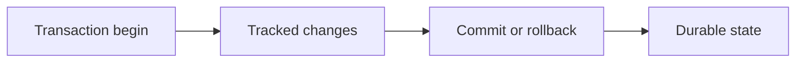

# v0.40 -- Transaction Abort & Rollback Protocols

---

## 1. Problem Statement

## Visual Model

When a query violates constraints (e.g. key collision) or conflicts with concurrent operations (deadlock), the database must abort the transaction. To satisfy the **Atomicity** guarantee (the 'A' in ACID, which states that a transaction's updates must execute completely or not at all), the engine must rollback and revert every byte change made by that transaction, returning database pages to their original states. We need to implement a rollback coordinator (**`TxnRollbackHelper`**) that logs modified byte before-images (**`UndoRecord`**) and writes them back to disk in reverse chronological sequence.

---

## 2. Step-by-Step Instructions

### Step 1: Design the Undo Record Descriptor
* Create a header file `src/concurrency/txn_rollback.h` within `namespace DB`.
* Include the transaction, disk manager, vector, and string headers.
* Define `struct UndoRecord` representing a before-image modification:
  * `rid` (type `RID`): Physical record location coordinates.
  * `page_offset` (uint16_t): Starting byte offset inside the page's data payload array where the write occurred.
  * `before_image` (type `std::vector<uint8_t>`): The raw bytes as they existed *before* they were overwritten.
  * Write a constructor initializing all variables.

### Step 2: Implement LIFO Rollback Reversions
* Inside the header, define `class TxnRollbackHelper`:
  * Declare a public static execution method:
    `static void ExecuteRollback(const std::shared_ptr<Transaction>& txn, const std::vector<UndoRecord>& undo_logs, DiskManager* disk_manager)`
  * Implement `ExecuteRollback(txn, undo_logs, disk_manager)`:
    * **Reverse Iteration Loop**: Loop through `undo_logs` in reverse order using reverse iterators:
      `for (auto it = undo_logs.rbegin(); it != undo_logs.rend(); ++it)`
      * Retrieve the current `UndoRecord` reference: `const UndoRecord& undo = *it;`.
      * Read the target page from disk:
        `disk_manager->ReadPage(undo.rid.page_id, &page);`
      * Revert bytes: Copy the `before_image` byte buffer back over the modified page data offset:
        `std::memcpy(page.data + undo.page_offset, undo.before_image.data(), undo.before_image.size());`
      * Write the reverted page back to disk:
        `disk_manager->WritePage(undo.rid.page_id, &page);`
    * Flush changes to disk: Call `disk_manager->Sync()`.
    * **Finalize State**: Set the transaction state to aborted: `txn->SetState(TransactionState::ABORTED);`.
    * **Release Locks**: Call `txn->ClearLocks();` to release all logged locks (this integrates with the lock manager in Phase 10).

---

## 3. C++ Systems Features Primer

* **Atomicity via Undo Logs**: Atomicity means "all or nothing". Since databases modify pages dynamically in cache frames (RAM) to speed up insertions, aborting a transaction requires restoring original page bytes. An `UndoRecord` stores the "before-image" of the modified byte slice. Replaying these before-images undoes the changes.
* **LIFO (Last-In-First-Out) Ordering**: Reversion must run backward (from the last change to the first). If a transaction changes a field $A \to B \to C$:
  * Reversing in LIFO order first reverts $C \to B$, and then reverts $B \to A$. The final value is the original $A$.
  * Reversing in forward order would revert $B \to A$, and then try to revert $C \to B$, leaving the final value as $B$ (corrupting the state).
* **C++ Reverse Iterators**: Iterating backwards. C++ containers support `rbegin()` (returns a pointer to the last element) and `rend()` (pointer to the index before the first element). Calling `++it` increment moves the iterator backwards toward the start.

---

## 4. Functional & Structural Requirements
* **LIFO Sequence**: Reversion operations must iterate the `undo_logs` array using reverse iterators, replaying writes in LIFO sequence.
* **Byte Alignment**: Reverted before-images must copy back to their exact original page offsets using `std::memcpy`.
* **State Finalization**: The transaction's final state must be registered as `ABORTED`.
* **Lock Releases**: Reverting a transaction must release all locks held in the transaction's registry.
* **Sync Enforcement**: Rollback page updates must be flushed to disk via `Sync()` to guarantee consistency.
