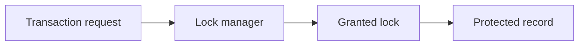

# v0.42 -- The Lock Table Manager Structure

---

## 1. Problem Statement

## Visual Model

In concurrent databases, transactions executing conflicting operations must be suspended (blocked) until the lock they need is released. We need to design a centralized coordinator class (**`LockManager`**) that manages a central registry called the **Lock Table** (mapping resources like slotted page Record IDs to request queues). The manager must declare interfaces to acquire shared read locks, exclusive write locks, and release locks, using condition variables to block and notify execution threads.

---

## 2. Step-by-Step Instructions

### Step 1: Design the Lock Request Queue
* Create a header file `src/concurrency/lock_manager.h` within `namespace DB`.
* Include the lock, RID, unordered map, list, mutex, and condition variable headers.
* Define `struct LockRequestQueue` representing active and pending requests on a resource:
  * `requests` (type `std::list<LockRequest>`): Linked list storing the sequence of transactions requesting this lock.
  * `cv` (type `std::condition_variable`): Thread synchronization variable to block and wake up transaction threads.
  * `is_shared_locked` (bool): True if the resource is currently held by read transactions.
  * `is_exclusive_locked` (bool): True if the resource is currently held by a write transaction.

### Step 2: Declare the Lock Manager Class
* Define `class LockManager`:
  * Declare private member variables:
    * `lock_table` (hash map mapping `RID` to `LockRequestQueue`): The central lock board.
    * `lock_table_mutex` (type `std::mutex`): Concurrency lock protecting the hash map structure itself from concurrent updates.
  * Declare public locking interfaces (as stubs):
    * `bool AcquireShared(TxID txn_id, const RID& rid)`: Requests a read lock.
    * `bool AcquireExclusive(TxID txn_id, const RID& rid)`: Requests a write lock.
    * `bool Release(TxID txn_id, const RID& rid)`: Releases a lock.

---

## 3. C++ Systems Features Primer

* **Thread Suspension (`std::condition_variable`)**: In LeetCode/DSA, you might wait by spinning in a loop (busy-wait: `while(!ready);`). Busy-waiting consumes 100% CPU time, slowing down the system. Modern systems programming uses condition variables from `<condition_variable>`. The thread locks a mutex and calls `cv.wait(lock)`. The OS puts the thread to sleep immediately, freeing up CPU cores.
* **Thread Notification (`cv.notify_all()`)**: When a thread finishes work, it returns its lock and calls `cv.notify_all()`. The OS wakes up all threads sleeping on that condition variable. They re-evaluate their lock compatibility and proceed if eligible.
* **Map Protection Mutexes**: While individual queue variables are synchronized by the CV, the central hash map `lock_table` is shared by all transactions. Inserting new keys or erasing empty queues dynamically will corrupt map buckets if done concurrently. We guard map manipulations using `lock_table_mutex`.

---

## 4. Functional & Structural Requirements
* **Namespace Isolation**: Lock managers must verify that locked resource keys match valid Record ID ranges.
* **Independent Suspensions**: Each resource entry in the lock table must have its own condition variable, ensuring threads waiting on Record ID A are not woken up when a lock on Record ID B is released.
* **Scaffold Safety**: The manager class must block copy constructions, preventing multiple lock boards.
* **Thread Safe Mappings**: Any mutation or read on the `lock_table` map must be guarded by `lock_table_mutex`.
