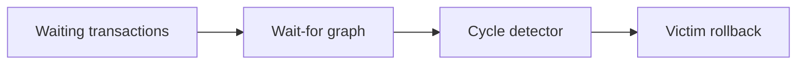

# v0.46 -- The Wait-for Graph Dependency Schema

---

## 1. Problem Statement

## Visual Model

When multiple transactions acquire locks concurrently, they can enter deadlock scenarios where they block each other in a circle, freezing database execution threads. To resolve deadlocks, the database engine must track transaction dependencies. We need to implement a directed dependency graph called a **Wait-for Graph** using an **Adjacency List** layout (mapping transaction nodes to vectors of target nodes representing edge links where transaction $T_1$ is blocked waiting for locks held by $T_2$).

---

## 2. Step-by-Step Instructions

### Step 1: Design the Wait-for Graph Class
* Create a header file `src/concurrency/wait_for_graph.h` within `namespace DB`.
* Include the type, unordered map, vector, and algorithm headers.
* Define `class WaitForGraph`:
  * Declare a private member variable:
    * `adj_list` (type `std::unordered_map<TxID, std::vector<TxID>>`): Graph representation.
  * Declare public graph manipulation interfaces:
    * `void AddEdge(TxID t1, TxID t2)`: Registers a dependency edge indicating $t_1$ waits for $t_2$.
    * `void RemoveEdge(TxID t1, TxID t2)`: Erases a dependency edge.
    * `void Clear()`: Wipes all nodes and edges from the graph.
    * `const std::unordered_map<TxID, std::vector<TxID>>& GetAdjList() const`: Returns a read-only reference to the adjacency list.

### Step 2: Implement Adjacency Mutations
* Implement `AddEdge(t1, t2)`:
  * Access the neighbors vector: `auto& neighbors = adj_list[t1];`.
  * Verify if `t2` is already in the vector using `std::find`. If not found, append `t2` using `push_back()`, preventing duplicate edges.
* Implement `RemoveEdge(t1, t2)`:
  * Search `adj_list` for `t1` using `find()`. If found:
    * Scan and remove `t2` from the neighbors vector using the standard C++ vector erase-remove idiom:
      `neighbors.erase(std::remove(neighbors.begin(), neighbors.end(), t2), neighbors.end());`
* Implement `Clear()`:
  * Call `adj_list.clear()`.

---

## 3. C++ Systems Features Primer

* **Directed Dependency Graphs**: A graph where edges have a direction (an arrow). In transaction management, node $T_1$ pointing to $T_2$ ($T_1 \to T_2$) represents a dependency: $T_1$ cannot execute until $T_2$ commits and releases its locks.
* **Adjacency Lists**: A common graph representation. Instead of allocating a huge two-dimensional grid of size $N \times N$ (adjacency matrix, which wastes memory for sparse graphs), we use a map of vectors. For each active node, we only store the list of nodes it currently points to, keeping memory overhead minimal.
* **Vector Erase-Remove Idiom**: In C++, removing an element from a `std::vector` by value requires combining two algorithms from `<algorithm>`:
  1. `std::remove` shifts all matching elements to the end of the vector and returns an iterator pointing to the start of the junk region.
  2. `vector.erase` deletes the junk elements, resizing the vector.

---

## 4. Functional & Structural Requirements
* **Uniqueness**: `AddEdge` must check and prevent duplicate edge additions between the same transaction nodes.
* **Read-only Access**: The `GetAdjList()` getter must return a const reference, preventing callers from mutating graph edges directly.
* **Safety Clearing**: Rebuilding the graph must call `Clear()` first to avoid stale dependencies.
