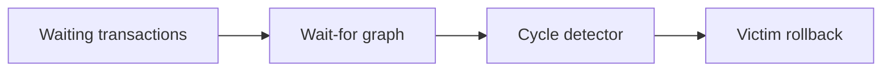

# v0.47 -- DFS Cycle Detection & Deadlocks

---

## 1. Problem Statement

## Visual Model

Deadlocks freeze database execution threads. A deadlock occurs if and only if there is a cycle (loop) in the Wait-for Graph. We need to implement a **Depth-First Search (DFS) Cycle Detection Algorithm** that recursively traverses the Wait-for Graph, tracks visited states and active recursion paths, identifies back-edges (pointing to a node already in the active search path), and selects a candidate victim transaction to abort when a cycle is found.

---

## 2. Step-by-Step Instructions

### Step 1: Design the DFS Cycle Detector
* Create a header file `src/concurrency/cycle_detector.h` within `namespace DB`.
* Include the wait-for graph and unordered set headers.
* Define `class CycleDetector`:
  * Declare a private static recursive crawler helper:
    `static bool DfsHelper(TxID current, const std::unordered_map<TxID, std::vector<TxID>>& adj_list, std::unordered_set<TxID>& visited, std::unordered_set<TxID>& rec_stack, TxID* victim_id)`
  * Declare the public check method:
    `static bool DetectCycle(const WaitForGraph& graph, TxID* victim_id)`

### Step 2: Implement the DFS Crawler & Backtracking
* Implement `DfsHelper(current, adj_list, visited, rec_stack, victim_id)`:
  * **Mark Active**: Insert `current` into the `visited` set and the `rec_stack` (recursion stack tracking the active search path).
  * **Scan Neighbors**: Search `adj_list` for the neighbors list of `current`. If found:
    * Loop through each `neighbor` in the neighbors vector:
      * **Check Loop**: If `neighbor` exists in the `rec_stack` set:
        * We have hit a **Back-Edge** (the path loop closed!). Set `*victim_id = neighbor`.
        * Return `true` (cycle detected).
      * **Recurse**: If `neighbor` does not exist in `visited` (has not been scanned):
        * Recursively call `DfsHelper` on the neighbor.
        * If this recursive call returns `true`, propagate `true` up the call stack immediately.
  * **Backtrack**: If the search from `current` concludes without finding a cycle, remove `current` from `rec_stack` before returning, clean up the path state, and return `false`.

### Step 3: Implement Global Cycle Search
* Implement `DetectCycle(graph, victim_id)`:
  * Instantiate `visited` and `rec_stack` sets (`std::unordered_set<TxID>`).
  * Retrieve the graph adjacency list map.
  * Loop through every node in the graph map:
    * If the node has not been visited, call `DfsHelper()`.
    * If any call returns `true`, return `true` (deadlock cycle found).
  * Return `false` (no cycles exist).

---

## 3. C++ Systems Features Primer

* **Depth-First Search (DFS)**: A graph traversal algorithm that explores as deep as possible along each branch before backtracking. DFS is the standard algorithm for cycle detection.
* **Back-Edges**: In directed graphs, a back-edge is an edge that points to an ancestor node in the DFS tree. Finding a back-edge means a cycle exists.
* **Backtracking state tracking**: We use a `rec_stack` hash set to track nodes in the active path. When returning from a recursive branch, we must erase the current node from the set. If we forget to erase it, the algorithm will flag false cycles (path crossovers that are not loops).
* **Hash Set Lookups (`std::unordered_set<T>`)**: Visited and recursion checks must be fast. Hash sets compile lookups as $O(1)$ constant-time operations, avoiding linear scanning delays.

---

## 4. Functional & Structural Requirements
* **Cycle Traps**: The algorithm must detect directed loops of any size.
* **Backtrack Cleanliness**: Nodes must be erased from the recursion stack before returning `false`, preventing false positive detections.
* **Victim Selection**: The candidate transaction ID node closing the cycle must be written to `victim_id`.
* **Graph Safety**: The detector must not mutate the Wait-for Graph nodes or edges during checks.
