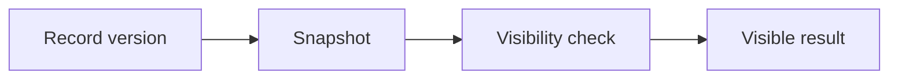

# v0.50 -- Row Visibility Rules

---

## 1. Problem Statement

## Visual Model

In MVCC, multiple versions of a record exist on disk simultaneously. A transaction reading the database must only see record versions that were created by transactions that committed before it started, and must skip records that were deleted by already-committed transactions. We need to implement a **Visibility Evaluator** (`Visibility::IsVisible()`) that evaluates each record's `MVCCRecordHeader` against a transaction's snapshot state, applying `xmin` (creation) and `xmax` (deletion) visibility rules to determine which record versions to expose.

---

## 2. Step-by-Step Instructions

### Step 1: Understand the Snapshot Dependency
* The visibility evaluator depends on a `Snapshot` class (defined in Phase v0.51).
* For now, understand that `Snapshot::IsActive(TxID txid)` returns `true` if `txid` was still executing when the snapshot was taken (i.e., the transaction is uncommitted from the snapshot's perspective).

### Step 2: Design the Visibility Evaluator
* Create a header file `src/concurrency/visibility.h` within `namespace DB`.
* Include the `mvcc_record.h` and `snapshot.h` headers.
* Define `class Visibility`:
  * Declare a public static evaluator method:
    `static bool IsVisible(const MVCCRecordHeader& header, const Snapshot& snapshot, TxID active_txn_id)`

### Step 3: Implement Visibility Logic
* Implement `IsVisible(header, snapshot, active_txn_id)`:
  * **Step 1 — Evaluate Creator (xmin)**:
    * If `header.xmin == active_txn_id`: Skip the snapshot check (a transaction can always see its own uncommitted inserts). Proceed to Step 2.
    * Else: Check `snapshot.IsActive(header.xmin)`.
      * If `true`: The creator was still executing when the snapshot was taken (uncommitted insert). Return `false` (record is invisible).
  * **Step 2 — Evaluate Deleter (xmax)**:
    * If `header.xmax == INVALID_TXN_ID`: The record has not been deleted. Return `true` (visible).
    * If `header.xmax == active_txn_id`: We deleted this record ourselves. Return `false` (invisible to ourselves).
    * Check `snapshot.IsActive(header.xmax)`.
      * If `true`: The deleter is still uncommitted in the snapshot. The deletion is not finalized. Return `true` (still visible).
    * If none of the above: The deleter has committed. Return `false` (deleted record is invisible).

---

## 3. C++ Systems Features Primer

* **Snapshot Isolation**: The guarantee that a transaction sees a consistent view of the database as it existed at the moment the transaction started, regardless of concurrent modifications.
* **xmin/xmax Visibility Matrix**:
  | xmin state | xmax state | Visible? |
  | :--- | :--- | :--- |
  | Committed | Not set | ✅ Yes |
  | Committed | Uncommitted | ✅ Yes (deletion pending) |
  | Committed | Committed | ❌ No (deleted) |
  | Uncommitted | Any | ❌ No (except if reader == creator) |
* **Self-Visibility (Own Writes)**: A transaction must always see its own uncommitted inserts and must not see its own uncommitted deletes. These are special cases that bypass the snapshot check.

---

## 4. Functional & Structural Requirements
* **Self-Visibility**: A transaction must always see its own uncommitted inserts (when `xmin == active_txn_id`).
* **Self-Delete Hiding**: A transaction must not see records it has deleted in the current session.
* **Uncommitted Deletion Tolerance**: Records deleted by uncommitted transactions are still visible to outside readers.
* **Const Correctness**: The evaluator must not mutate the snapshot or the record header.
