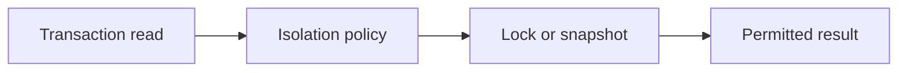

# v0.54 -- Read Committed Isolation Level

---

## 1. Problem Statement

## Visual Model

In the weakest common isolation level (**Read Committed**), each query statement inside a transaction sees the most recently committed data, rather than the state at transaction start. This prevents **Dirty Reads** (reading uncommitted data) but allows **Non-Repeatable Reads** (the same query returning different results if another transaction commits between two identical queries). We need to implement a **`ReadCommittedSnapshot`** class that creates a fresh snapshot of the active transaction registry on every new query statement inside a transaction.

---

## 2. Step-by-Step Instructions

### Step 1: Design the Read Committed Snapshot Helper
* Create a header file `src/concurrency/read_committed.h` within `namespace DB`.
* Include the snapshot, transaction manager, and unordered map headers.
* Define `class ReadCommittedSnapshot`:
  * Declare a public static factory method:
    `static Snapshot GetStatementSnapshot(TransactionManager* txn_manager, const std::unordered_map<TxID, std::shared_ptr<Transaction>>& active_txns)`

### Step 2: Implement Dynamic Snapshot Capture
* Implement `GetStatementSnapshot(txn_manager, active_txns)`:
  * Initialize: `TxID min_active = INVALID_TXN_ID`, `TxID max_active = 0`, and an empty `std::vector<TxID> active_list`.
  * **Scan Registry**: Loop through all `(txid, txn)` pairs in the `active_txns` map:
    * Append each `txid` to `active_list`.
    * Update `min_active` if `txid < min_active` (or if `min_active == INVALID_TXN_ID`).
    * Update `max_active` if `txid > max_active`.
  * Handle empty registry: If `min_active == INVALID_TXN_ID`, set `min_active = max_active + 1`.
  * Return `Snapshot(min_active, max_active, active_list)`.

---

## 3. C++ Systems Features Primer

* **Read Committed vs. Repeatable Read**: Two different points for capturing transaction snapshots:
  * **Read Committed**: Captures a fresh snapshot at the start of **each query statement**. A transaction's second query may see records committed between its first and second query.
  * **Repeatable Read**: Captures a snapshot at the start of **the entire transaction**. All queries reuse the same snapshot, so newly committed records remain invisible.
* **Non-Repeatable Reads**: Running the same query twice inside a Read Committed transaction can return different rows, because another transaction committed new records between the two queries.

---

## 4. Functional & Structural Requirements
* **Per-Statement Refresh**: The snapshot must be reconstructed on every query invocation, not cached between statements.
* **Active Registry Scan**: The snapshot must include all transactions currently registered in the active map.
* **Bounds Calculation**: The min/max boundaries must be computed dynamically from the current registry state.
