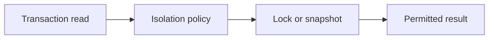

# v0.55 -- Repeatable Read Isolation Level

---

## 1. Problem Statement

## Visual Model

Under **Read Committed**, two identical queries inside the same transaction can return different results if another transaction commits in between. This is called a **Non-Repeatable Read** and can corrupt application logic (e.g. calculating totals based on inconsistent data). We need to implement **Repeatable Read** isolation, where a single snapshot is captured at the **start of the transaction** and reused for all subsequent query statements, ensuring stable, consistent reads throughout the transaction's lifetime.

---

## 2. Step-by-Step Instructions

### Step 1: Design the Repeatable Read Snapshot Manager
* Create a header file `src/concurrency/repeatable_read.h` within `namespace DB`.
* Include the snapshot, transaction, and read committed headers.
* Define `class RepeatableReadSnapshot`:
  * Declare private member variables:
    * `txn_snapshot` (type `Snapshot`): The pinned snapshot object.
    * `has_snapshot` (bool): Initialized to `false`, tracking whether the snapshot has been captured yet.
  * Write a default constructor initializing `txn_snapshot` to an empty snapshot.
  * Declare a public getter method:
    `Snapshot GetTxnSnapshot(TransactionManager* txn_manager, const std::unordered_map<TxID, std::shared_ptr<Transaction>>& active_txns)`

### Step 2: Implement One-Time Capture Logic
* Implement `GetTxnSnapshot(txn_manager, active_txns)`:
  * Check `has_snapshot`:
    * If `false`: Capture a fresh snapshot for the **first and only time** by calling `ReadCommittedSnapshot::GetStatementSnapshot(txn_manager, active_txns)`. Store it in `txn_snapshot`. Set `has_snapshot = true`.
    * If `true`: Skip recapturing.
  * Return `txn_snapshot`.

---

## 3. C++ Systems Features Primer

* **Repeatable Read Guarantee**: Reading the same row twice inside a Repeatable Read transaction always returns identical data, because the snapshot pinned at transaction start treats any concurrently committed record as "started after our snapshot boundary" and makes it invisible.
* **Phantom Reads**: Even under Repeatable Read, a **Phantom Read** can occur. If another transaction inserts a *new* row that matches a query's range filter, the range query may return more rows the second time it runs (the new row was invisible from xmin being too new, but the range of matching data "changed"). Preventing Phantoms requires Serializable isolation.
* **Persistent State Storage**: The `RepeatableReadSnapshot` helper must be stored inside the `Transaction` object, not inside the query executor. If created locally inside the executor, it is destroyed and recreated on every query call, losing the pinned snapshot.

---

## 4. Functional & Structural Requirements
* **One-Time Capture**: `GetTxnSnapshot()` must only invoke `GetStatementSnapshot()` on the first call. All subsequent calls must return the same cached snapshot.
* **Persistent Lifetime**: The snapshot manager must remain alive for the full duration of the transaction.
* **Snapshot Immutability**: After capture, the stored snapshot must not be modified.
