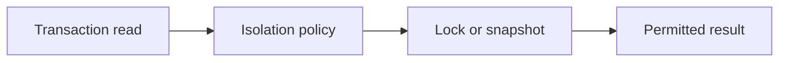

# v0.56 -- Serializable Isolation Level

---

## 1. Problem Statement

## Visual Model

Even under Repeatable Read, **Write Skew** anomalies can occur. Two transactions read the same data, each validates a condition, and both decide to write — but each transaction's write invalidates the other's assumption. To prevent Write Skew and Phantom Reads, the highest isolation level (**Serializable**) forces every read to acquire a Shared Lock, ensuring that writers cannot modify records currently being read by another transaction. We need to implement a **`SerializableLocking`** coordinator that enforces this "readers block writers" contract.

---

## 2. Step-by-Step Instructions

### Step 1: Design the Serializable Coordinator
* Create a header file `src/concurrency/serializable.h` within `namespace DB`.
* Include the lock manager and transaction headers.
* Define `class SerializableLocking`:
  * Declare a public static read-prepare method:
    `static bool PrepareRead(const std::shared_ptr<Transaction>& txn, LockManager* lock_manager, const RID& rid)`

### Step 2: Implement Read Locking
* Implement `PrepareRead(txn, lock_manager, rid)`:
  * Log the operation: Print that the transaction is acquiring a Shared Lock on the target Record ID.
  * Acquire the S-lock: Call `lock_manager->AcquireShared(txn->GetTxID(), rid)`.
    * If granted (`true`):
      * Register the lock in the transaction context: `txn->AddLock(rid)`.
      * Return `true`.
    * If denied (`false`):
      * Return `false`.

---

## 3. C++ Systems Features Primer

* **Write Skew**: Two concurrent transactions each read a shared condition and then write based on it. Example: Both check that a bank account balance is above $0, both decide to debit $80, both commit. The balance ends up negative, violating the constraint. Neither Repeatable Read nor Read Committed prevents this.
* **How Serializable Stops Write Skew**: By acquiring S-locks on every read, the reading transaction blocks concurrent writers from modifying those records until the reader commits and releases the S-lock. This forces a serialized, one-at-a-time access pattern.
* **Deadlock Frequency**: Serializable isolation increases deadlock frequency significantly. If two transactions each read and then write the same records, they will likely deadlock (both hold S-locks, both request X-locks). The deadlock resolver (Phase 11) must be running to detect and abort victims.

---

## 4. Isolation Level Comparison

| Isolation Level | Dirty Reads | Non-Repeatable Reads | Phantom Reads | Write Skew |
| :--- | :--- | :--- | :--- | :--- |
| **Read Committed** | ❌ Prevented | ✅ Possible | ✅ Possible | ✅ Possible |
| **Repeatable Read** | ❌ Prevented | ❌ Prevented | ✅ Possible | ✅ Possible |
| **Serializable** | ❌ Prevented | ❌ Prevented | ❌ Prevented | ❌ Prevented |

---

## 5. Functional & Structural Requirements
* **Lock-Before-Read**: `PrepareRead()` must acquire the S-lock before the record data is accessed.
* **Registration**: Every acquired lock must be logged in the transaction's held locks vector via `txn->AddLock(rid)`.
* **Strict 2PL Integration**: Locks acquired by Serializable reads must be held until the transaction commits or aborts, releasing via `Strict2PL::ReleaseAllLocks()`.
