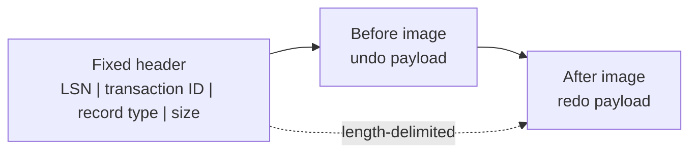

# v0.58 -- Log Records & Serialization

---

## 1. Problem Statement

## Visual Model

### Serialized Log Record

The WAL journal file stores a stream of binary records, each describing a single database event (an insert, update, delete, or transaction boundary). The recovery engine must parse these records precisely to reconstruct database history after crashes. We need to design a **`LogRecord`** struct with a `LogRecordType` enum, before/after-image payload vectors, and binary `Serialize()`/`Deserialize()` methods using length-prefixed encoding, ensuring correct round-trip fidelity.

---

## 2. Step-by-Step Instructions

### Step 1: Design the Log Record Type Enum
* Create a header file `src/recovery/log_record.h` within `namespace DB`.
* Include the type, RID, serializer, and vector headers.
* Define `enum class LogRecordType : uint8_t` with values:
  * `BEGIN = 0`, `COMMIT = 1`, `ABORT = 2`: Transaction boundaries.
  * `INSERT = 3`, `UPDATE = 4`, `DELETE = 5`: Record modifications.
  * `COMPENSATION = 6`: Compensating log records written during undo.

### Step 2: Design the Log Record Struct
* Define `struct LogRecord`:
  * Declare data fields:
    * `lsn` (type `LSN`): Log sequence number, initialized to `INVALID_LSN`.
    * `txn_id` (type `TxID`): Transaction ID, initialized to `INVALID_TXN_ID`.
    * `type` (type `LogRecordType`): Record operation type.
    * `rid` (type `RID`): Target modified record location.
    * `before_image` (type `std::vector<uint8_t>`): Raw bytes of the record slot before modification (used for UNDO).
    * `after_image` (type `std::vector<uint8_t>`): Raw bytes of the record slot after modification (used for REDO).
  * Write a default constructor.
  * Write a constructor for transaction boundary records: `LogRecord(LSN l, TxID tid, LogRecordType t)`.
  * Write a constructor for modification records: `LogRecord(LSN l, TxID tid, LogRecordType t, RID r, std::vector<uint8_t> before, std::vector<uint8_t> after)`.

### Step 3: Implement Binary Serialization
* Implement `void Serialize(Serializer& serializer) const`:
  * Write fields in order: `lsn` (int64), `txn_id` (int64), `type` (byte), `rid.page_id` (int64), `rid.slot_num` (int64).
  * Write the before-image: Write the size as int64, then loop and write each byte.
  * Write the after-image: Write the size as int64, then loop and write each byte.
* Implement `void Deserialize(Deserializer& deserializer)`:
  * Read fields in the **exact same order** as `Serialize()`.
  * Resize the before/after-image vectors using `resize()` and fill them byte-by-byte.

---

## 3. C++ Systems Features Primer

* **Before-Image and After-Image**: Two payload snapshots are stored for every record modification:
  * **Before-Image**: The raw bytes of the record slot *before* the write. Used by UNDO to roll back the operation.
  * **After-Image**: The raw bytes of the record slot *after* the write. Used by REDO to replay the operation.
* **Length-Prefixed Serialization**: Since images are variable-size byte buffers, we cannot read them without knowing their size. By writing the length first (as a fixed-size int64), the deserializer can safely allocate the correct number of bytes before reading.
* **Field Order Invariant**: The order in which fields are written in `Serialize()` must be **identical** to the order in which they are read in `Deserialize()`. A mismatch causes field corruption.

---

## 4. Functional & Structural Requirements
* **Round-Trip Fidelity**: Serializing a `LogRecord` and then deserializing it must produce a struct with byte-identical fields.
* **Variable Length Safety**: Before and after-image vectors must use length-prefix encoding.
* **Default Initialization**: All fields must initialize to invalid/empty states in the default constructor.
