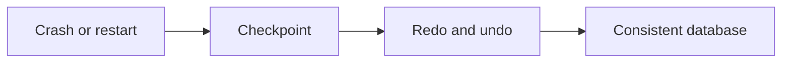

# v0.62 -- The REDO Phase

---

## 1. Problem Statement

## Visual Model

After a crash, the main database file may be stale — buffer pool dirty pages that were modified but not yet flushed to disk are lost. The WAL contains the authoritative history of all modifications. We need to implement the **REDO Phase** of the ARIES recovery protocol: scan the WAL forward from the last checkpoint LSN, and re-apply every record modification to the database pages, making the page data consistent with the WAL log history.

---

## 2. Step-by-Step Instructions

### Step 1: Design the REDO Recovery Class
* Create a header file `src/recovery/redo_phase.h` within `namespace DB`.
* Include the disk manager, log record, and slotted page headers.
* Define `class RedoRecovery`:
  * Declare a public static execution method:
    `static void ReplayLogForward(DiskManager* disk_manager, const std::vector<LogRecord>& records, LSN checkpoint_lsn)`

### Step 2: Implement Forward Log Replay
* Implement `ReplayLogForward(disk_manager, records, checkpoint_lsn)`:
  * **Iterate Forward**: Loop through `records` in forward order.
  * **Skip Old Records**: If `record.lsn < checkpoint_lsn`, continue (skip records already reflected in the checkpoint).
  * **Skip Non-Modifications**: If `record.type` is not `INSERT`, `UPDATE`, or `DELETE`, continue.
  * For each modification record:
    * **Read the Page**: Load the page using `record.rid.page_id`.
    * **Skip Already Applied**: Compare `page.header.pageLSN` against `record.lsn`:
      * If `page.header.pageLSN >= record.lsn`: The change is already on disk. Skip.
    * **Apply the Change**: Copy the `after_image` bytes into the page slot:
      * Load the slot using `SlottedPage::GetSlot(&page, record.rid.slot_num)`.
      * Use `std::memcpy` to copy `record.after_image.data()` into `page.data + slot->offset`.
      * Update `slot->length = record.after_image.size()`.
    * **Update Page LSN**: Set `page.header.pageLSN = record.lsn`.
    * **Write Back**: Call `disk_manager->WritePage(record.rid.page_id, &page)`.
  * After the loop, call `disk_manager->Sync()`.

---

## 3. C++ Systems Features Primer

* **ARIES REDO Protocol**: ARIES stands for "Algorithm for Recovery and Isolation Exploiting Semantics." During REDO, it follows the principle of **"repeating history"** — re-executing every log record in the WAL from the last checkpoint forward, even those belonging to transactions that ultimately aborted. This restores the exact pre-crash state, allowing the subsequent UNDO phase to cleanly roll back only uncommitted work.
* **Page LSN Idempotency Check**: The key safety check: if `page.pageLSN >= record.lsn`, the page already reflects this change and skipping is safe. Without this check, replaying the same log record twice would corrupt the page.
* **std::memcpy**: Copies raw bytes from one memory address to another. We use it to apply after-image bytes directly into the page data array without type interpretation.

---

## 4. Functional & Structural Requirements
* **Forward Scan**: Records must be processed in increasing LSN order (forward chronological).
* **Checkpoint Boundary**: All records with `lsn < checkpoint_lsn` must be skipped.
* **Idempotency**: The `pageLSN >= record.lsn` check must prevent applying already-reflected changes.
* **Disk Sync**: All replayed pages must be flushed to disk via `Sync()` after replay completes.
