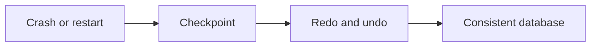

# v0.63 -- The UNDO Phase

---

## 1. Problem Statement

## Visual Model

After the REDO phase re-applies all committed and uncommitted changes, the database is in a state consistent with the pre-crash moment, but uncommitted transactions have left dirty partial modifications on data pages. To satisfy **Atomicity** (ACID), these uncommitted changes must be reverted. We need to implement the **UNDO Phase**: scan the WAL backward, roll back all modifications from transactions that had no `COMMIT` or `ABORT` record before the crash, and write **Compensation Log Records (CLRs)** to protect against re-undoing already-reverted changes during a second crash.

---

## 2. Step-by-Step Instructions

### Step 1: Design the UNDO Recovery Class
* Create a header file `src/recovery/undo_phase.h` within `namespace DB`.
* Include the disk manager, log record, slotted page, vector, and unordered set headers.
* Define `class UndoRecovery`:
  * Declare a public static execution method:
    `static void RollbackLogBackward(DiskManager* disk_manager, const std::vector<LogRecord>& records, const std::unordered_set<TxID>& active_txns)`

### Step 2: Implement Backward Log Rollback
* Implement `RollbackLogBackward(disk_manager, records, active_txns)`:
  * **Reverse Iteration**: Loop through `records` using reverse iterators (`records.rbegin()` to `records.rend()`).
  * For each record:
    * **Filter Active**: If `record.txn_id` is **not** in `active_txns`, skip (only undo uncommitted transactions).
    * **Filter Modifications**: If `record.type` is not `INSERT`, `UPDATE`, or `DELETE`, skip.
    * **Load Page**: Read the target page using `disk_manager->ReadPage(record.rid.page_id, &page)`.
    * **Revert Slot**:
      * Load the slot: `PageSlot* slot = SlottedPage::GetSlot(&page, record.rid.slot_num)`.
      * If reverting an `INSERT`: Set `slot->length = 0` (erase the slot).
      * If reverting an `UPDATE` or `DELETE`: Copy `record.before_image` bytes back using `std::memcpy`, update `slot->length = record.before_image.size()`.
    * **Update Page LSN**: Set `page.header.pageLSN = record.lsn`.
    * **Write Page Back**: Call `disk_manager->WritePage(record.rid.page_id, &page)`.
    * **Write CLR Stub**: Log a note (in a full implementation, append a `COMPENSATION` log record to the WAL to mark this rollback as complete).
  * After the loop, call `disk_manager->Sync()`.

---

## 3. C++ Systems Features Primer

* **Compensation Log Records (CLRs)**: After reverting a modification, we write a CLR to the WAL marking the undo as complete. If the database crashes again *during* the UNDO phase, the recovery engine will see the CLR and skip re-reverting that specific change. This is the ARIES mechanism that guarantees recovery always terminates.
* **LIFO Ordering in UNDO**: Modifications must be reversed in Last-In-First-Out order (scanning backward). If a field was changed $A \to B \to C$, reversing backward gives $C \to B$ then $B \to A$, correctly restoring $A$. Reversing forward would produce $B$ instead.
* **Active Transaction Set**: The UNDO phase identifies uncommitted transactions from the analysis pass: any transaction that has a `BEGIN` record but no matching `COMMIT` or `ABORT` record in the WAL log.

---

## 4. Functional & Structural Requirements
* **Reverse Scan**: Must use reverse iterators (`rbegin()`/`rend()`) to process records in LIFO order.
* **Active Filter**: Only revert modifications belonging to transactions in the `active_txns` set.
* **Correct Slot Operations**: Inserts must be removed (length = 0). Updates/Deletes must restore before-image bytes.
* **Disk Sync**: All reverted pages must be flushed to disk after the UNDO sweep completes.
