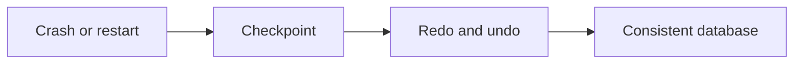
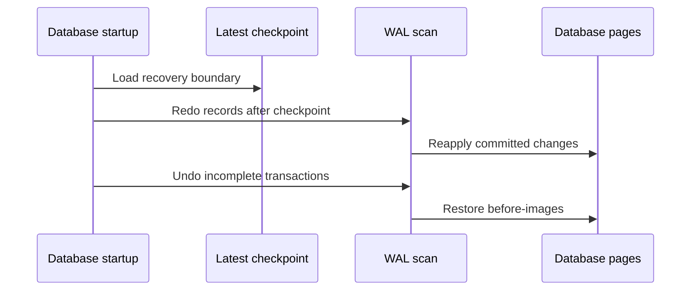

# v0.64 -- Crash Recovery Engine

---

## 1. Problem Statement

## Visual Model

### Restart Recovery Sequence

On every database startup, the engine must determine if the previous shutdown was clean or if a crash occurred, and if so, automatically execute the ARIES recovery protocol to restore the database to a consistent state before accepting any client queries. We need to implement a **`RecoveryEngine`** coordinator that orchestrates the three-pass ARIES recovery sequence: Analysis (identify uncommitted transactions), REDO (replay all log history from the last checkpoint), and UNDO (roll back uncommitted changes).

---

## 2. Step-by-Step Instructions

### Step 1: Design the Recovery Engine
* Create a header file `src/recovery/recovery_engine.h` within `namespace DB`.
* Include the disk manager, REDO phase, UNDO phase, and WAL headers.
* Define `class RecoveryEngine`:
  * Declare private member variables:
    * `disk_manager` (pointer to `DiskManager`).
    * `wal_filepath` (type `std::string`).
  * Write a constructor binding both.
  * Declare a public recovery execution method:
    `void Recover(const std::vector<LogRecord>& records, LSN checkpoint_lsn)`

### Step 2: Implement the Three-Pass ARIES Protocol
* Implement `Recover(records, checkpoint_lsn)`:
  * **Pass 1 — REDO**: Call `RedoRecovery::ReplayLogForward(disk_manager, records, checkpoint_lsn)`.
  * **Pass 2 — Analysis**: Scan `records` forward to build the active transaction set:
    * Maintain an `std::unordered_set<TxID> active_txns`.
    * On each record:
      * If `record.type == BEGIN`: Insert `record.txn_id` into `active_txns`.
      * If `record.type == COMMIT` or `ABORT`: Erase `record.txn_id` from `active_txns`.
  * **Pass 3 — UNDO**: If `active_txns` is not empty, call `UndoRecovery::RollbackLogBackward(disk_manager, records, active_txns)`.
  * Log a message confirming the database is consistent and online.

---

## 3. C++ Systems Features Primer

* **ARIES Three-Pass Protocol**:
  1. **Analysis**: Scans the WAL from the last checkpoint to identify which transactions were active (uncommitted) at crash time and which pages were dirty.
  2. **REDO**: Replays all logged changes from the checkpoint forward, repeating history to restore the exact pre-crash state.
  3. **UNDO**: Rolls back all uncommitted transactions' changes in reverse order, restoring ACID atomicity.
* **Boot Blocking**: Client queries must be blocked until the recovery engine completes. If clients read pages during the REDO phase (before UNDO), they may observe uncommitted dirty data. We enforce serialized startup by running `Recover()` synchronously in the main initialization thread.
* **WAL File Reader**: In production, `ReadLogFile()` would read binary log records from the WAL file on disk. For this curriculum phase, we pass mock log records directly to verify the recovery logic.

---

## 4. Functional & Structural Requirements
* **REDO Before UNDO**: The REDO pass must fully complete before the UNDO pass begins.
* **Analysis Completeness**: The active transaction set must be computed by scanning the full log, not just the checkpoint active list.
* **Sequential Boot**: Recovery must block all client access until the three passes are complete.
* **Idempotent Design**: Running recovery on an already-consistent database must produce no incorrect changes.
