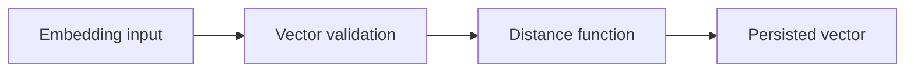

# v0.65 -- The Vector Type

---

## 1. Problem Statement

## Visual Model

Vector databases store high-dimensional float arrays called **embeddings** — numerical representations of text, images, or any data produced by machine learning models. We need to design a **`Vector`** container class that stores a fixed-dimension float array with contiguous memory layout, provides safe dimension and data access APIs, and supports efficient SIMD-compatible raw pointer access for distance calculations.

---

## 2. Step-by-Step Instructions

### Step 1: Design the Vector Container Class
* Create a header file `src/vector/vector.h` within `namespace DB`.
* Create the directory `src/vector/` if it does not exist.
* Include the vector and stdexcept headers.
* Define `class Vector`:
  * Declare a private member variable:
    * `elements` (type `std::vector<float>`): Stores the float embedding components.
  * Write a constructor:
    `explicit Vector(std::vector<float> elms)` — store using `std::move(elms)`.
  * Declare public accessor methods:
    * `size_t GetDimensions() const`: Returns the number of float elements.
    * `const float* Data() const`: Returns a raw const pointer to the first float element.
    * `const std::vector<float>& GetElements() const`: Returns a const reference to the float vector.

---

## 3. C++ Systems Features Primer

* **Embeddings**: Machine learning models (like sentence transformers or image CNNs) produce fixed-length float arrays representing data in a high-dimensional semantic space. Two similar items (e.g. "dog" and "wolf") produce vectors that are numerically close to each other.
* **Contiguous Memory (`std::vector<float>`)**: Float elements are stored side-by-side in a single contiguous RAM block. This layout is essential for:
  * **SIMD (Single Instruction Multiple Data)**: CPU AVX2 registers can load 8 floats from contiguous memory in one instruction.
  * **Disk Serialization**: Contiguous layout allows writing the entire float array to a byte buffer in a single `memcpy` call.
* **Explicit Constructors**: Marking the constructor `explicit` prevents the compiler from silently converting a `std::vector<float>` to a `Vector` object in unexpected places.
* **`std::move` in Constructor**: Using `Vector(std::vector<float> elms)` with `elements(std::move(elms))` transfers ownership of the float array's heap memory without copying bytes, making construction $O(1)$.

---

## 4. Functional & Structural Requirements
* **Contiguous Storage**: Float elements must be stored in a `std::vector<float>` (guaranteed contiguous by the C++ standard).
* **Move Semantics**: The constructor must use `std::move()` to avoid copying the float array.
* **Raw Pointer Access**: `Data()` must return `elements.data()`, enabling SIMD pointer arithmetic.
* **Immutable Container**: After construction, the elements vector must not be mutable from outside the class.
