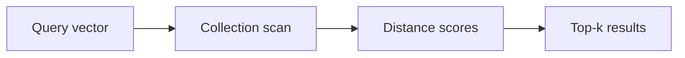

# v0.70 -- Search Metrics & Profiling

---

## 1. Problem Statement

## Visual Model

Vector search queries need performance profiling to identify bottlenecks: Are we spending time on distance computations? On disk I/O? On result sorting? We need to implement a **`SearchMetrics`** struct that tracks key statistics per query (distance calculations performed, pages read from disk, and total query latency), providing a `StartTimer()`/`StopTimer()` interface and a `Print()` summary.

---

## 2. Step-by-Step Instructions

### Step 1: Design the Search Metrics Struct
* Create a header file `src/vector/search_metrics.h` within `namespace DB`.
* Include the `<chrono>` and iostream headers.
* Define `struct SearchMetrics`:
  * Declare public data variables:
    * `uint64_t distance_calculations = 0`: Counter incremented once per vector comparison.
    * `uint64_t pages_read = 0`: Counter incremented once per page loaded from disk.
    * `double query_latency_ms = 0.0`: Total end-to-end query latency in milliseconds.
  * Declare private member variables:
    * `start_time` (type `std::chrono::high_resolution_clock::time_point`): Captures the query start timestamp.
  * Declare public methods:
    * `void StartTimer()`: Records the current timestamp.
    * `void StopTimer()`: Computes elapsed time and stores in `query_latency_ms`.
    * `void Print() const`: Prints a formatted summary to stdout.
    * `void Reset()`: Resets all counters and latency to zero.

### Step 2: Implement Timer Methods
* Implement `StartTimer()`:
  * `start_time = std::chrono::high_resolution_clock::now();`
* Implement `StopTimer()`:
  * Capture end time: `auto end_time = std::chrono::high_resolution_clock::now();`.
  * Calculate duration:
    `query_latency_ms = std::chrono::duration<double, std::milli>(end_time - start_time).count();`
* Implement `Print()`:
  * Print each metric with labels using `std::cout`.

---

## 3. C++ Systems Features Primer

* **`std::chrono`**: The C++ standard library for time measurement. `high_resolution_clock::now()` returns the current time as a `time_point`. Subtracting two `time_point` values produces a `duration`, which can be cast to milliseconds using `duration<double, std::milli>`.
* **Profiling Counters**: Incrementing a `uint64_t` counter at critical execution points (like inside the distance calculation call) lets us measure the computational work done per query without using complex profiler tools.
* **Why Profiling Matters**: For vector databases, the dominant costs are distance computation (CPU-bound) and page loading (I/O-bound). Knowing which dominates guides optimization: if distance calculations dominate, use SIMD; if pages dominate, use better indexing.

---

## 4. Functional & Structural Requirements
* **Timer Precision**: Use `std::chrono::high_resolution_clock` for sub-millisecond precision.
* **Counter Accuracy**: `distance_calculations` must be incremented exactly once per pairwise comparison.
* **Reset Support**: `Reset()` must zero all metrics to allow reuse across multiple queries.
* **Non-Intrusive**: Profiling must not modify any search result or database state.
