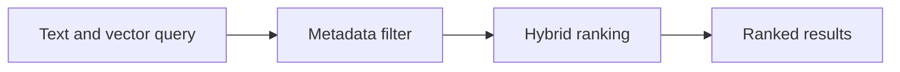

# v0.79 -- Hybrid Query Optimization

---

## 1. Problem Statement

## Visual Model

The hybrid search planner must automatically choose between pre-filter and post-filter strategies based on query selectivity estimates. Running pre-filter brute-force on a low-selectivity filter (e.g., only 1 out of a million documents matches) is wasteful compared to a targeted HNSW post-filter scan. We need to implement a **`HybridQueryOptimizer`** that estimates filter selectivity from collection statistics and selects the optimal execution strategy.

---

## 2. Step-by-Step Instructions

### Step 1: Design the Statistics Tracker
* Create a header file `src/query/collection_stats.h` within `namespace DB`.
* Define `struct CollectionStats`:
  * `uint64_t total_documents = 0`: Total number of documents in the collection.
  * `std::unordered_map<std::string, double> field_selectivity`: Estimated fraction (0.0–1.0) of documents that pass each individual field filter (precomputed or estimated from field value cardinality).

### Step 2: Design the Optimizer
* Create `src/query/hybrid_optimizer.h` within `namespace DB`.
* Define `class HybridQueryOptimizer`:
  * Declare a static decision method:
    `static bool ShouldPreFilter(const CompositeFilter& filter, const CollectionStats& stats, double pre_filter_threshold = 0.05)`
  * Implement:
    * Estimate the composite filter selectivity:
      * For `AND` filters: Multiply individual field selectivities together.
      * For `OR` filters: Use: `1 - product(1 - selectivity_i)`.
    * If estimated selectivity `<= pre_filter_threshold`: Return `true` (pre-filter is cheaper).
    * Otherwise: Return `false` (post-filter with HNSW is cheaper).

---

## 3. C++ Systems Features Primer

* **Selectivity Estimation**: A selectivity of 0.01 means ~1% of documents match. This is a key concept in relational database query planning (where selectivity estimates are also used to choose between index scans and full table scans).
* **AND Filter Selectivity**: If filter A matches 10% and filter B matches 20%, an AND combination matches ~2% (0.1 × 0.2), assuming independence. This is a simplified approximation used in practice.
* **OR Filter Selectivity**: If filter A matches 10% and filter B matches 20%, an OR combination matches 28% (using inclusion-exclusion).

---

## 4. Functional & Structural Requirements
* **Threshold-Based Decision**: The optimizer must compare estimated selectivity against a configurable `pre_filter_threshold` (e.g., 0.05 = 5%).
* **Default Fallback**: If no selectivity statistics are available for a field, assume 0.5 (50% selectivity as a neutral default).
* **Composable Logic**: Must support both `AND` and `OR` composite filter selectivity formulas.
