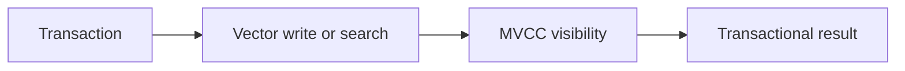

# v0.81 -- Transactional Vector Index

---

## 1. Problem Statement

## Visual Model

When a vector document is inserted inside a transaction, it must not be visible in HNSW search results until the transaction commits. Conversely, if the transaction aborts, the inserted node must be removed from the HNSW graph. We need to implement a **transactional HNSW index wrapper** that defers HNSW insertions until commit time and removes nodes from the graph on transaction abort.

---

## 2. Step-by-Step Instructions

### Step 1: Design the Transactional Index State
* Create a header file `src/vector/txn_vector_index.h` within `namespace DB`.
* Include the HNSW graph, transaction, and unordered map headers.
* Define `class TxnVectorIndex`:
  * Declare private member variables:
    * `hnsw_graph` (pointer to `HNSWGraph`): The shared global index.
    * `pending_inserts` (type `std::unordered_map<TxID, std::vector<uint64_t>>`): Tracks node IDs inserted by each transaction that have not yet been committed.
    * `pending_deletes` (type `std::unordered_map<TxID, std::vector<uint64_t>>`): Tracks node IDs soft-deleted by each transaction.
    * `index_mutex` (type `std::mutex`).
  * Write a constructor binding the HNSW graph.
  * Declare public methods:
    * `void IndexInsert(TxID txn_id, uint64_t node_id, const RID& rid, Vector vec)`: Inserts but marks as pending.
    * `void IndexDelete(TxID txn_id, uint64_t node_id)`: Soft-deletes the node.
    * `void OnCommit(TxID txn_id)`: Confirms all pending inserts as visible.
    * `void OnAbort(TxID txn_id)`: Removes all pending insert nodes from the HNSW graph.

### Step 2: Implement Deferred Visibility
* Implement `IndexInsert(txn_id, node_id, rid, vec)`:
  * Acquire `index_mutex`.
  * Call `hnsw_graph->Insert(node_id, rid, std::move(vec))`.
  * Mark the node as "uncommitted" by appending `node_id` to `pending_inserts[txn_id]`.
  * Set `hnsw_graph->GetNode(node_id).is_deleted = true` to hide it from search until commit.
* Implement `OnCommit(txn_id)`:
  * For each `node_id` in `pending_inserts[txn_id]`: Set `is_deleted = false` (now visible).
  * Clear `pending_inserts[txn_id]`.
* Implement `OnAbort(txn_id)`:
  * For each `node_id` in `pending_inserts[txn_id]`: Call `hnsw_graph->HardRemove(node_id)` (remove from graph).
  * Clear `pending_inserts[txn_id]`.

---

## 3. C++ Systems Features Primer

* **Deferred Visibility Trick**: We insert the node into the HNSW graph immediately (so the graph builds its links correctly), but hide it from search results by setting `is_deleted = true`. On commit, we flip it to `false`. On abort, we hard-remove it.
* **Two-Phase Indexing**: This pattern (insert-but-hide, then reveal-on-commit) mirrors how MVCC handles record visibility: the record exists on disk immediately, but visibility is controlled by xmin/xmax timestamps.

---

## 4. Functional & Structural Requirements
* **Hidden Until Commit**: Inserted nodes must have `is_deleted = true` until `OnCommit()` is called.
* **Hard Removal on Abort**: Aborted inserts must physically remove the node from the HNSW graph.
* **Thread Safety**: All operations must be protected by `index_mutex`.
