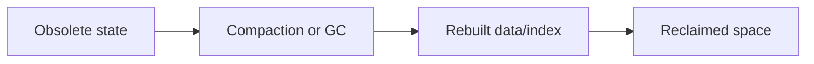

# v0.84 -- Page-Level MVCC Garbage Collection

---

## 1. Problem Statement

## Visual Model

In Phase v0.53 we designed the MVCC garbage collector that marks dead record slots. Now we need to wire it into a complete **background GC sweep** that computes the `oldest_active_txn_id` from the live transaction registry, triggers `MVCCGarbageCollector::PurgeDeadVersions()`, and follows up with `SlottedPage::CompactPage()` on each modified page to reclaim the freed space.

---

## 2. Step-by-Step Instructions

### Step 1: Implement the Oldest Active TxID Calculator
* In `TransactionManager`, declare a public method:
  `TxID GetOldestActiveTxID() const`
* Implement:
  * Acquire the transaction manager's active registry lock.
  * Loop through all `(txid, txn)` entries in the active map.
  * Return the minimum `txid`. If the map is empty, return the current `next_txn_id` (no active readers, everything is safe to purge).

### Step 2: Implement the GC Background Sweep
* Create `src/storage/gc_coordinator.h` within `namespace DB`.
* Define `class GCCoordinator`:
  * Declare private members: pointers to `TransactionManager`, `DiskManager`.
  * Declare a public method: `void RunGCSweep()`
  * Implement `RunGCSweep()`:
    * Call `txn_manager->GetOldestActiveTxID()` to get the safety threshold.
    * Call `MVCCGarbageCollector::PurgeDeadVersions(disk_manager, oldest_txn_id)`.
    * After purging each page, call `SlottedPage::CompactPage(page)` and write back.

---

## 3. C++ Systems Features Primer

* **Oldest Active TxID Safety**: The GC threshold must be the minimum across ALL currently active transactions, not just the most recently started one. A long-running analytics query (TxID 5) must block purging of records visible at its start snapshot, even if 10,000 newer transactions have committed since.
* **GC Frequency**: Running GC on every write would be too slow. Production systems run GC as a background thread on a timer (e.g., every 30 seconds) or trigger it when the ratio of dead-to-live slots on a page exceeds a threshold (e.g., 50%).

---

## 4. Functional & Structural Requirements
* **Safe Threshold**: The GC must compute `min(active_txids)` before purging. Never use the current timestamp.
* **Compact After Purge**: Every page modified by GC must be compacted immediately to consolidate free space.
* **Write-Back**: All modified pages must be written to disk and synced after the sweep.
