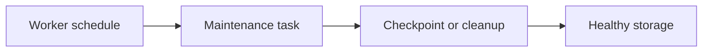

# v0.88 -- Checkpoint Worker

---

## 1. Problem Statement

## Visual Model

The WAL file grows indefinitely unless periodic checkpoints flush dirty pages and truncate old log records. We need a **`CheckpointWorker`** that extends `BackgroundWorker` and periodically triggers the `CheckpointManager::CreateCheckpoint()` on a timer, ensuring recovery time stays bounded and WAL disk usage remains controlled.

---

## 2. Step-by-Step Instructions

### Step 1: Design the Checkpoint Worker
* Create a header file `src/workers/checkpoint_worker.h` within `namespace DB`.
* Include the background worker and checkpoint manager headers.
* Define `class CheckpointWorker : public BackgroundWorker`:
  * Declare private member variables:
    * `checkpoint_manager` (pointer to `CheckpointManager`).
    * `active_txns_ref` (const reference or pointer to the active transaction map).
  * Write a constructor accepting `CheckpointManager*`, the active txns map reference, and an interval.
  * Implement the protected override:
    `void RunTask() override`

### Step 2: Implement the Checkpoint Task
* Implement `RunTask()`:
  * Log: *"CheckpointWorker: Running scheduled checkpoint..."*
  * Call `checkpoint_manager->CreateCheckpoint(*active_txns_ref)`.
  * Log: *"CheckpointWorker: Checkpoint complete."*

---

## 3. C++ Systems Features Primer

* **Why Periodic Checkpoints**: Without them, a database crash after 8 hours of writes would require replaying 8 hours of WAL records. With checkpoints every 30 seconds, recovery replays only 30 seconds of records at most.
* **WAL Log Truncation**: After a successful checkpoint, WAL records older than the checkpoint start LSN are no longer needed for recovery. The WAL writer can truncate (delete or overwrite) the old log segments. This prevents the WAL file from filling the disk.
* **Active Transaction Awareness**: The checkpoint must pass the current active transaction map so it can log active transaction IDs in the `CHECKPOINT_END` record.

---

## 4. Functional & Structural Requirements
* **Periodic Execution**: `RunTask()` fires on the configured interval (typically every 30-60 seconds).
* **Non-Blocking**: The checkpoint must not block client queries beyond the duration of a buffer flush.
* **Graceful Stop**: When `Stop()` is called, the worker must finish any in-progress checkpoint before exiting.
