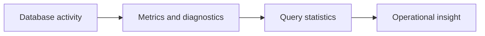

# v0.91 -- Runtime Metrics

---

## 1. Problem Statement

## Visual Model

To understand how the database is performing at runtime, we need a centralized metrics registry that components can increment counters in, and an external observer can read from. We need to implement a **`MetricsRegistry`** (a thread-safe singleton) with atomic counters for key operational measurements: queries executed, total inserts, cache hit/miss rates, WAL bytes written, and active transactions.

---

## 2. Step-by-Step Instructions

### Step 1: Design the Metrics Registry
* Create a header file `src/observability/metrics_registry.h` within `namespace DB`.
* Include the atomic header.
* Define `class MetricsRegistry` as a singleton:
  * Declare a public static accessor: `static MetricsRegistry& Instance()`
  * Declare private atomic counters:
    * `std::atomic<uint64_t> queries_executed{0}`
    * `std::atomic<uint64_t> total_inserts{0}`
    * `std::atomic<uint64_t> total_updates{0}`
    * `std::atomic<uint64_t> total_deletes{0}`
    * `std::atomic<uint64_t> buffer_pool_hits{0}`
    * `std::atomic<uint64_t> buffer_pool_misses{0}`
    * `std::atomic<uint64_t> wal_bytes_written{0}`
    * `std::atomic<uint64_t> active_transactions{0}`
  * Declare public increment methods for each counter.
  * Declare a `void PrintSummary() const` method.

### Step 2: Implement the Singleton and Increment Methods
* Implement `Instance()`: Use Meyer's singleton pattern — declare a `static MetricsRegistry instance;` inside the function body and return a reference.
* Implement each increment method using `counter.fetch_add(1, std::memory_order_relaxed)`.
* Implement `PrintSummary()`: Print each counter with a label using `std::cout`.

---

## 3. C++ Systems Features Primer

* **Singleton Pattern (Meyer's Singleton)**: A `static` local variable inside a function is initialized exactly once (thread-safe since C++11). This avoids the complexity of `new`-allocated singletons and their lifetime issues.
* **`std::atomic<uint64_t>`**: Incrementing shared counters from multiple threads without a mutex. Using `memory_order_relaxed` is safe for counters because we only care about the count being consistent, not about ordering relative to other memory operations.
* **Why Metrics Matter**: Runtime metrics expose database health in production — dropping buffer pool hit rate signals that the buffer pool is too small; rising `active_transactions` signals a transaction processing bottleneck.

---

## 4. Functional & Structural Requirements
* **Thread Safety**: All counter increments must be atomic.
* **Singleton Lifetime**: The registry must outlive all components that use it.
* **Readable Summary**: `PrintSummary()` must print all counters in a human-readable format.
