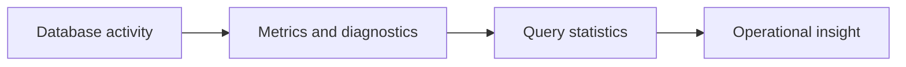

# v0.92 -- Diagnostics & Health Checks

---

## 1. Problem Statement

## Visual Model

Beyond raw counters, operators need structured health checks that report system component states: Is the WAL flushed? Is the buffer pool near capacity? Are background workers alive? We need to implement a **`DiagnosticsEngine`** that collects health snapshots from all major subsystems and formats a human-readable system report.

---

## 2. Step-by-Step Instructions

### Step 1: Design the Health Report Struct
* Create a header file `src/observability/diagnostics.h` within `namespace DB`.
* Define `struct HealthReport`:
  * `bool wal_healthy`: Whether the WAL flushed LSN is within 1 second of the current timestamp.
  * `double buffer_pool_fill_ratio`: Fraction of buffer pool frames currently pinned.
  * `bool checkpoint_worker_alive`: Whether the checkpoint worker thread is running.
  * `bool gc_worker_alive`: Whether the GC worker thread is running.
  * `double hnsw_deletion_ratio`: Fraction of deleted HNSW nodes.
  * `uint64_t active_transactions`: Count of currently active transactions.

### Step 2: Design the Diagnostics Engine
* Define `class DiagnosticsEngine`:
  * Declare private member pointers to all major subsystem components.
  * Write a constructor binding them.
  * Declare a public method: `HealthReport CollectReport()`
  * Declare a public method: `void PrintReport(const HealthReport& report) const`

### Step 3: Implement Report Collection
* Implement `CollectReport()`:
  * `report.buffer_pool_fill_ratio = bpm->GetPinnedPageCount() / (double)bpm->GetTotalFrames()`.
  * `report.hnsw_deletion_ratio = hnsw_graph->GetDeletionRatio()`.
  * `report.active_transactions = MetricsRegistry::Instance().active_transactions.load()`.
  * Set worker alive flags based on thread status checks.
  * Return report.
* Implement `PrintReport()`: Print each field with color/symbol coding:
  * Buffer fill > 90%: Print a warning marker.
  * HNSW deletion > compact threshold: Print a maintenance needed marker.

---

## 3. C++ Systems Features Primer

* **Structured Health Checks**: Rather than printing raw counters, health checks interpret counter values against thresholds. A buffer pool fill of 80% is a warning; 99% is critical. This is how production databases expose operational status (e.g., PostgreSQL's `pg_stat_*` views).
* **Diagnostic vs. Metrics**: Metrics count events over time (queries per second). Diagnostics capture a point-in-time state snapshot (buffer pool fill right now). Both are necessary.

---

## 4. Functional & Structural Requirements
* **Non-Intrusive**: `CollectReport()` must not modify any database state or acquire exclusive locks.
* **Threshold Markers**: `PrintReport()` must flag suspicious values (buffer fill > 90%, high deletion ratio).
* **Complete Coverage**: Report must cover WAL health, buffer pool, both background workers, HNSW state, and transaction count.
