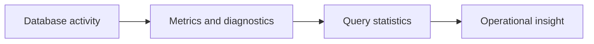

# v0.93 -- Query Statistics

---

## 1. Problem Statement

## Visual Model

To understand query performance, we need per-query execution statistics: how long each query took, how many distance calculations it performed, and how many pages it loaded from disk. We need to implement a **`QueryStats`** tracker that wraps query execution with a timer and accumulates per-query counters, enabling query-level profiling and slow-query detection.

---

## 2. Step-by-Step Instructions

### Step 1: Design the Per-Query Stats Accumulator
* Create a header file `src/observability/query_stats.h` within `namespace DB`.
* Include `<chrono>`, `<string>`, and the metrics registry header.
* Define `class QueryStats`:
  * Declare public data fields (counters to be incremented during a single query):
    * `std::string query_type`: E.g., `"knn"`, `"insert"`, `"scan"`.
    * `uint64_t distance_calculations = 0`
    * `uint64_t pages_read = 0`
    * `uint64_t records_scanned = 0`
    * `double latency_ms = 0.0`
  * Declare private timing fields:
    * `start_time` (type `std::chrono::high_resolution_clock::time_point`)
  * Declare public methods:
    * `void Begin(const std::string& type)`: Start a query, record type and start time.
    * `void End()`: Stop timer, compute latency.
    * `void ReportToRegistry()`: Push key stats to `MetricsRegistry`.
    * `void Print() const`: Print a formatted per-query stats summary.

### Step 2: Implement Query Lifecycle Methods
* Implement `Begin(type)`:
  * `query_type = type; start_time = std::chrono::high_resolution_clock::now();`
* Implement `End()`:
  * `auto end = std::chrono::high_resolution_clock::now(); latency_ms = std::chrono::duration<double, std::milli>(end - start_time).count();`
* Implement `ReportToRegistry()`:
  * Increment `MetricsRegistry::Instance().queries_executed`.
  * If `latency_ms > 100.0`: Log a slow query warning.

---

## 3. C++ Systems Features Primer

* **Slow Query Detection**: Queries exceeding a latency threshold (e.g., 100ms for interactive workloads) are "slow queries." Logging them with their full statistics helps identify bottlenecks.
* **Per-Query Stats vs. Global Metrics**: Global metrics aggregate across all queries (total queries, total pages). Per-query stats provide the fine-grained breakdown needed to understand *why* a specific query was slow.
* **RAII-Style Timing**: Consider using RAII to auto-call `End()` when a `QueryStats` object goes out of scope. Define a destructor that calls `End()` and `Print()` if the query hasn't been ended manually yet.

---

## 4. Functional & Structural Requirements
* **Latency Measurement**: Use `std::chrono::high_resolution_clock` for sub-millisecond precision.
* **Slow Query Threshold**: Queries exceeding 100ms must log a warning to the console.
* **Registry Integration**: `ReportToRegistry()` must increment the global `queries_executed` counter.
* **Resettable**: All counters must reset to zero when `Begin()` is called to enable reuse.
