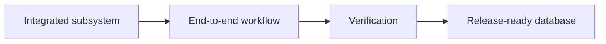

# v1.0 -- Final Integration: The Database Engine

---

## 1. Problem Statement

## Visual Model

All 23 phases have built individual, independently verifiable subsystems. Now we need to wire them all together into a single **`DatabaseEngine`** class — the top-level object that owns every subsystem, boots in the correct sequence (recovery before serving queries), starts background workers, exposes a clean API for inserts, queries, and deletions, and shuts down cleanly.

---

## 2. What You Have Built (Full System Map)

Before integration, verify that every subsystem from every phase is implemented:

| Phase | Subsystem | Key Class |
| :--- | :--- | :--- |
| 1 | Document Model | `Document`, `Value` |
| 2 | Disk Manager | `DiskManager`, `Page` |
| 3 | Record Storage | `SlottedPage`, `RecordManager` |
| 4 | Buffer Pool | `BufferPoolManager` |
| 5 | Catalog | `Catalog`, `CollectionManager` |
| 6 | B+ Tree Index | `BPlusTree` |
| 7 | Query Engine | `QueryExecutor`, `QueryPlanner` |
| 8 | Query Optimization | `CostModel`, `LogicalPlan`, `PhysicalPlan` |
| 9 | Transactions | `Transaction`, `TransactionManager` |
| 10 | Concurrency Control | `LockManager`, `Strict2PL` |
| 11 | Deadlock Detection | `WaitForGraph`, `DeadlockResolver` |
| 12 | MVCC | `MVCCRecordHeader`, `Snapshot`, `Visibility` |
| 13 | Isolation Levels | `ReadCommittedSnapshot`, `RepeatableReadSnapshot`, `SerializableLocking` |
| 14 | WAL | `WALManager`, `WALWriter`, `LogRecord` |
| 15 | Recovery | `CheckpointManager`, `RedoRecovery`, `UndoRecovery`, `RecoveryEngine` |
| 16 | Vector Engine | `Vector`, `Distance`, `VectorSerializer` |
| 17 | Brute-Force Search | `FlatSearchExecutor`, `BoundedPriorityQueue`, `SearchMetrics` |
| 18 | HNSW Index | `HNSWGraph`, `HNSWNode` |
| 19 | Hybrid Search | `HybridSearchExecutor`, `FilterEvaluator`, `HybridQueryOptimizer` |
| 20 | Transactional Vectors | `TxnVectorIndex`, `MVCCVectorSearch` |
| 21 | Compaction & GC | `SlottedPage::CompactPage`, `GCCoordinator`, `IndexRebuilder` |
| 22 | Background Workers | `BackgroundWorker`, `CheckpointWorker`, `GarbageCollectorWorker`, `VectorMaintenanceWorker` |
| 23 | Observability | `MetricsRegistry`, `DiagnosticsEngine`, `QueryStats` |

---

## 3. Step-by-Step Integration Instructions

### Step 1: Design the Database Engine
* Create a header file `src/engine/database_engine.h` within `namespace DB`.
* Define `class DatabaseEngine`:
  * Declare private member variables (one for each major subsystem):
    * `DiskManager disk_manager`
    * `BufferPoolManager buffer_pool`
    * `Catalog catalog`
    * `RecordManager record_manager`
    * `TransactionManager txn_manager`
    * `LockManager lock_manager`
    * `DeadlockResolver deadlock_resolver`
    * `WALManager wal_manager`
    * `WALWriter wal_writer`
    * `CheckpointManager checkpoint_manager`
    * `HNSWGraph hnsw_graph`
    * `TxnVectorIndex txn_vector_index`
    * `GCCoordinator gc_coordinator`
    * `CheckpointWorker checkpoint_worker`
    * `GarbageCollectorWorker gc_worker`
    * `VectorMaintenanceWorker vector_worker`
    * `DiagnosticsEngine diagnostics`

### Step 2: Implement the Boot Sequence
* Implement a constructor or `Open(const std::string& db_path)` method:
  1. Open the disk manager file.
  2. Initialize buffer pool with the disk manager.
  3. Load the catalog (collection metadata).
  4. **Run WAL Recovery** (ARIES): Load WAL log records, call `RecoveryEngine::Recover()`.
  5. Load the HNSW index file (or rebuild if missing).
  6. Start background workers: `checkpoint_worker.Start()`, `gc_worker.Start()`, `vector_worker.Start()`.
  7. Log: *"Database is online and ready."*

### Step 3: Implement the Public API
* Declare and implement public methods:
  * `std::shared_ptr<Transaction> BeginTransaction()`:
    * Call `txn_manager.Begin()`. Increment `MetricsRegistry::Instance().active_transactions`.
  * `bool InsertDocument(std::shared_ptr<Transaction> txn, const std::string& collection, Document doc)`:
    * Acquire X-lock on the collection page range.
    * Write WAL INSERT record.
    * Write to slotted page via `record_manager`.
    * Insert vector into `txn_vector_index`.
    * Increment `MetricsRegistry::Instance().total_inserts`.
  * `std::vector<SearchResult> VectorSearch(std::shared_ptr<Transaction> txn, const Vector& query, int k)`:
    * Capture a snapshot via the isolation level handler.
    * Call `MVCCVectorSearch::Search(query, k, ef, snapshot, txn->GetTxID())`.
    * Update `MetricsRegistry::Instance().queries_executed`.
    * Return results.
  * `void Commit(std::shared_ptr<Transaction> txn)`:
    * Release all locks via `Strict2PL::ReleaseAllLocks()`.
    * Flush WAL commit record via `CommitDurability::ForceCommitSync()`.
    * Call `txn_vector_index.OnCommit(txn->GetTxID())`.
    * Decrement `MetricsRegistry::Instance().active_transactions`.
  * `void Abort(std::shared_ptr<Transaction> txn)`:
    * Undo the transaction's changes from the WAL.
    * Call `txn_vector_index.OnAbort(txn->GetTxID())`.
    * Release all locks.

### Step 4: Implement the Shutdown Sequence
* Implement `void Close()`:
  1. Stop background workers: `checkpoint_worker.Stop()`, `gc_worker.Stop()`, `vector_worker.Stop()`.
  2. Run a final checkpoint to flush all dirty pages.
  3. Save the HNSW index to disk.
  4. Flush the WAL.
  5. Close the disk manager file.
  6. Print `MetricsRegistry::Instance().PrintSummary()`.

---

## 4. C++ Systems Features Primer

* **Initialization Order**: C++ initializes class members in the order they are declared in the class body, not the constructor initializer list. Order your member declarations logically — disk manager first (others depend on it), then buffer pool, catalog, etc.
* **RAII (Resource Acquisition Is Initialization)**: The `DatabaseEngine` destructor should call `Close()` automatically. This ensures that even if an exception is thrown, the database flushes and closes cleanly without data loss.
* **Composition over Inheritance**: The engine uses composition — it *owns* instances of each subsystem as member variables. This makes the lifetime of each subsystem clearly tied to the engine's lifetime.

---

## 5. Final Verification Checklist

Before declaring v1.0 complete, run all the following checks:

- [ ] **Boot Sequence**: Create a new database, insert 100 documents with vectors, shut down. Restart and verify all documents are still there.
- [ ] **Recovery Test**: Insert 50 documents, kill the process (no clean shutdown). Restart and verify all committed documents are recovered correctly.
- [ ] **Transaction Rollback**: Begin a transaction, insert 10 documents, abort. Verify the documents are not visible to subsequent queries.
- [ ] **MVCC Isolation**: Start two transactions (T1 and T2). T2 inserts a document. T1 queries before T2 commits — verifies the new document is invisible. After T2 commits, T1 queries again — under Read Committed, verifies the document is now visible.
- [ ] **Vector Search Accuracy**: Insert 1000 vectors. Run kNN search and compare results against brute-force search. Recall should be > 95%.
- [ ] **Concurrent Writers**: Launch 10 threads each inserting 100 documents concurrently. Verify no crashes, no duplicate IDs, and all 1000 documents are present after all threads finish.
- [ ] **Background Worker Lifecycle**: Verify all 3 background workers start, run for 60 seconds without errors, and stop cleanly on `Close()`.
- [ ] **Metrics Collection**: After running 100 queries, verify `MetricsRegistry::Instance().queries_executed == 100`.

---

## 6. What You Have Learned

By completing this project, you have built a **production-grade vector database from scratch** and learned:

1. **Storage Engines**: How databases store data on disk in fixed-size pages using slotted page layouts.
2. **Buffer Pool Management**: How databases cache pages in RAM and manage cache eviction.
3. **B+ Tree Indexing**: How sorted index structures enable fast point and range lookups.
4. **Query Processing**: How queries are parsed, planned, optimized, and executed.
5. **Transaction Management**: How ACID properties are implemented with transaction contexts.
6. **Concurrency Control**: How databases serialize access using Strict 2PL lock managers.
7. **Deadlock Detection**: How cycle detection in wait-for graphs resolves transaction deadlocks.
8. **MVCC**: How databases allow readers and writers to run concurrently without blocking by maintaining multiple record versions.
9. **Isolation Levels**: The trade-offs between Read Committed, Repeatable Read, and Serializable.
10. **Write-Ahead Logging**: How WAL guarantees durability and enables crash recovery.
11. **ARIES Recovery**: How the three-pass Analysis/REDO/UNDO protocol restores consistency after crashes.
12. **Vector Embeddings**: How ML model outputs are stored and searched as float arrays.
13. **HNSW Indexing**: How hierarchical navigable small world graphs enable fast approximate nearest-neighbor search.
14. **Hybrid Search**: How metadata filters and vector search are combined efficiently.
15. **Systems Programming**: How to write thread-safe, memory-efficient, disk-aware C++ systems code.
